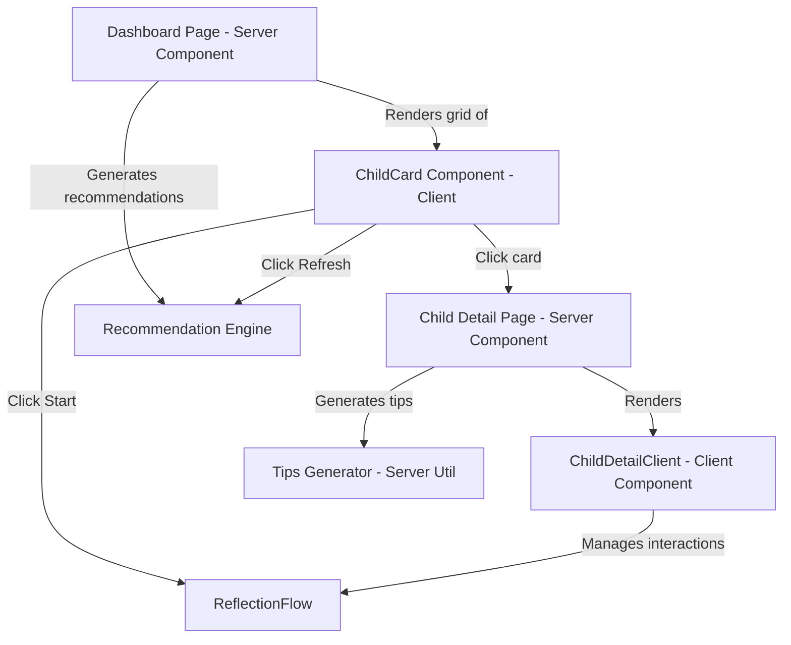
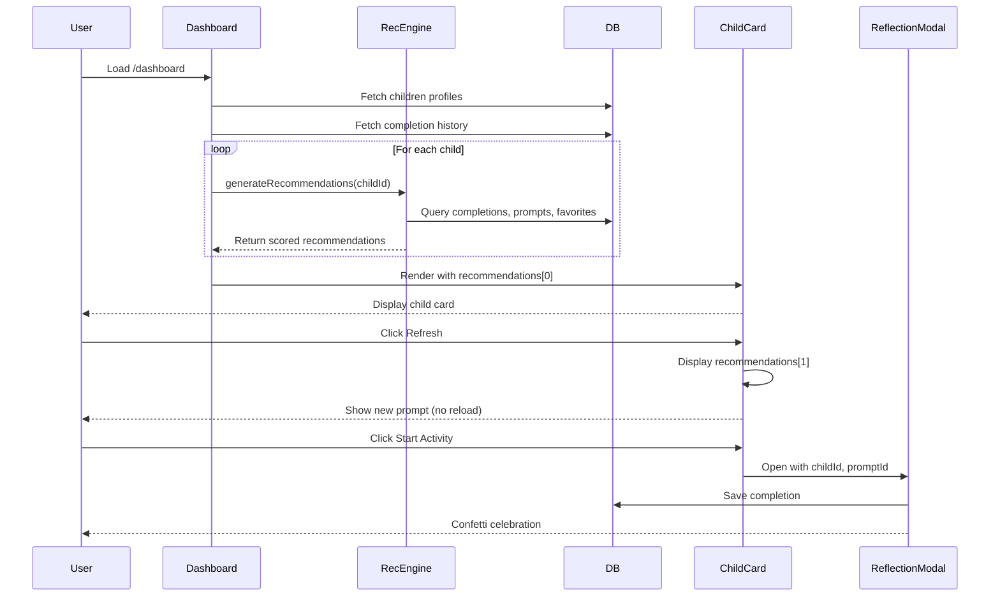

# Child-Centric Dashboard Redesign - Design Document

## Overview

This design implements a complete UX transformation from "prompt-first" to "child-first" mental model. The architecture leverages existing infrastructure (recommendation engine, child profiles, completion tracking) while reorganizing the presentation layer to center around children rather than prompts.

**Key Design Principles:**
1. **Parent-Friendly Mental Model**: Parents think "What should I do with Emma?" not "What prompt should I browse?"
2. **Instant Gratification**: One click from dashboard to activity start
3. **Progressive Disclosure**: Quick overview on dashboard, detailed insights on child pages
4. **Performance First**: Leverage existing data, minimize new queries
5. **Backward Compatible**: No breaking changes to existing features

## Architecture

### System Overview



### Component Hierarchy

```
app/dashboard/page.tsx (Server Component)
├── ChildCardGrid (Client Component)
│   ├── ChildCard (Client Component) × N
│   │   ├── PromptPreview
│   │   ├── QuickActions (Start, Refresh)
│   │   └── CategoryBadge
│   └── AddChildCard (Client Component)
│
app/children/[id]/page.tsx (Server Component)
├── ChildDetailClient (Client Component)
│   ├── TodaysPromptSection
│   │   ├── PromptCard (reuse TodaysPromptCard)
│   │   ├── RefreshButton
│   │   └── FavoriteButton
│   ├── ConnectionInsights
│   │   ├── StatsGrid (time, categories, completions)
│   │   └── StreakBadge
│   ├── PersonalizedTips
│   │   └── TipCard × 3-5
│   ├── RecentActivityHistory
│   │   └── ActivityHistoryItem × 7
│   └── MoreIdeas
│       └── RecommendedPromptCard × 4-6
```

### Data Flow



## Components and Interfaces

### 1. ChildCard Component

**File**: `components/ChildCard.tsx`

**Purpose**: Display a child's profile card with today's personalized prompt and quick actions.

**Props Interface**:
```typescript
interface ChildCardProps {
  child: {
    id: string
    name: string
    age: number
    birth_date: string
  }
  recommendations: ScoredPrompt[]
  onStartActivity: (promptId: string, childId: string) => void
  completedToday?: boolean
}
```

**State**:
```typescript
const [currentIndex, setCurrentIndex] = useState(0) // Track which recommendation is shown
const [isRefreshing, setIsRefreshing] = useState(false)
const [isStarting, setIsStarting] = useState(false)
```

**Behavior**:
- Display child name and age prominently
- Show recommendations[currentIndex] as today's prompt
- Handle refresh button click: increment currentIndex, loop back to 0 at end
- Handle start button click: trigger onStartActivity callback
- Navigate to `/children/{id}` when card body clicked
- Disable actions if completedToday

**Visual Design**:
- Gradient background: `from-blue-50 via-purple-50 to-pink-50`
- Border with hover effect: `border-2 border-primary-200 hover:border-primary-400`
- Shadow: `shadow-lg hover:shadow-2xl`
- Category emoji badge in top-right
- Estimated time badge
- Responsive: Full width mobile, grid on desktop

### 2. ChildCardGrid Component

**File**: `components/ChildCardGrid.tsx`

**Purpose**: Layout wrapper for child cards with responsive grid.

**Props Interface**:
```typescript
interface ChildCardGridProps {
  children: Child[]
  recommendationsMap: Record<string, RecommendationResult>
  completedTodayMap: Record<string, boolean>
  onStartActivity: (promptId: string, childId: string) => void
}
```

**Layout**:
- CSS Grid with responsive breakpoints
- `grid-cols-1 md:grid-cols-2 lg:grid-cols-3`
- Equal height cards: `auto-rows-fr`
- Gap: `gap-6`
- Include AddChildCard as last item

### 3. Child Detail Page

**File**: `app/children/[id]/page.tsx`

**Server Component** - Fetches all data server-side for optimal performance

**Data Fetching**:
```typescript
// Parallel data fetch for performance
const [child, recommendations, completions, favorites, insights] = await Promise.all([
  getChild(childId),
  generateRecommendations({ childId, limit: 10 }),
  getChildCompletions(childId, { limit: 7 }),
  getChildFavorites(childId),
  calculateInsights(childId)
])

const tips = generatePersonalizedTips(child, insights, completions)
```

**Data Passed to Client**:
- child profile
- recommendations (array of 10)
- recent completions (last 7 days)
- connection insights (pre-calculated)
- personalized tips (pre-generated)

### 4. ChildDetailClient Component

**File**: `components/ChildDetailClient.tsx`

**Purpose**: Client-side interactivity for child detail page (refresh, start activity, etc.)

**Props Interface**:
```typescript
interface ChildDetailClientProps {
  child: Child
  recommendations: ScoredPrompt[]
  recentCompletions: Completion[]
  insights: ConnectionInsights
  tips: PersonalizedTip[]
  faithMode: boolean
  userId: string
}
```

**State Management**:
```typescript
const [currentPromptIndex, setCurrentPromptIndex] = useState(0)
const [reflectionOpen, setReflectionOpen] = useState(false)
const [completingPromptId, setCompletingPromptId] = useState<string | null>(null)
```

**Sections Rendered**:
1. Back navigation
2. Child header with name/age
3. TodaysPromptSection (large card with full details)
4. ConnectionInsights (stats grid)
5. PersonalizedTips (tip cards)
6. RecentActivityHistory (list)
7. MoreIdeas (recommendation grid)

### 5. ConnectionInsights Component

**File**: `components/ConnectionInsights.tsx`

**Purpose**: Display child-specific connection statistics and patterns.

**Props Interface**:
```typescript
interface ConnectionInsightsProps {
  insights: {
    weeklyMinutes: number
    monthlyMinutes: number
    totalCompletions: number
    currentStreak: number
    favoriteCategories: { category: string; count: number }[]
    categoryDistribution: { category: string; percentage: number }[]
  }
  childName: string
}
```

**Visual Layout**:
```
┌─────────────────────────────────────────┐
│  📊 Connection Insights                 │
├─────────────────────────────────────────┤
│  ┌──────────┐  ┌──────────┐  ┌────────┐│
│  │   45     │  │   180    │  │   12   ││
│  │ This Week│  │This Month│  │ Total  ││
│  │ minutes  │  │ minutes  │  │  Done  ││
│  └──────────┘  └──────────┘  └────────┘│
│                                         │
│  Favorite Categories:                  │
│  🎨 Creative (5)  💝 Connection (4)    │
│  🌱 Behavior (3)                        │
└─────────────────────────────────────────┘
```

**Conditional Display**:
- If totalCompletions < 5: Show "Just Getting Started!" message
- If currentStreak > 0: Highlight streak with fire emoji
- If weeklyMinutes === 0: Show encouraging "Start this week" message

### 6. PersonalizedTips Component

**File**: `components/PersonalizedTips.tsx`

**Purpose**: Display actionable coaching tips for the parent.

**Props Interface**:
```typescript
interface PersonalizedTipsProps {
  tips: PersonalizedTip[]
  childName: string
}

interface PersonalizedTip {
  id: string
  type: 'developmental' | 'category_balance' | 'engagement' | 'streak' | 're_engagement'
  message: string
  priority: number
  icon: string
}
```

**Visual Design**:
- Each tip is a card with icon and message
- Color-coded by type:
  - Developmental: blue gradient
  - Category Balance: orange gradient
  - Engagement: green gradient
  - Streak: red gradient
  - Re-engagement: purple gradient
- Limit to 5 tips maximum
- Sort by priority (highest first)

### 7. TipsGenerator Utility

**File**: `lib/tips-generator.ts`

**Purpose**: Generate rule-based personalized tips for each child.

**Function Signature**:
```typescript
export function generatePersonalizedTips(
  child: Child,
  insights: ConnectionInsights,
  completions: Completion[]
): PersonalizedTip[]
```

**Tip Generation Rules**:

**Developmental Tips** (based on age):
```typescript
const developmentalTips = {
  '0-2': 'Infants thrive on sensory experiences - activities with textures, sounds, and movement',
  '2-4': 'Toddlers are learning emotional regulation - activities that name and validate feelings',
  '5-7': 'Early elementary children are developing empathy - activities that help notice others\' feelings',
  '8-11': 'Older elementary children value independence - activities that give them choices',
  '12-14': 'Early teens need connection without pressure - side-by-side activities work well',
  '15-18': 'Teens value authenticity - asking their opinion and really listening builds connection'
}
```

**Category Balance Tips**:
- If category > 40% of completions: "You've been doing lots of {category} activities! Try mixing in some {underrepresented} ones"
- If category < 5% and total completions > 10: "{childName} might enjoy trying {category} activities"

**Engagement Tips**:
- If reflection notes > 50%: "You're great at reflecting on moments with {childName}!"
- If duration > estimated consistently: "{childName} really takes their time - this shows deep engagement"
- If favorites > 3: "{childName} loves {favoritePrompt.title} - try similar activities"

**Streak Tips**:
- If currentStreak >= 3: "You're on a {streak}-day streak with {childName}! Keep it going!"
- If currentStreak >= 7: "Amazing! A full week of connection with {childName}!"

**Re-engagement Tips**:
- If last completion > 7 days: "It's been {days} days - {childName} would love some connection time!"

**Priority Scoring**:
1. Re-engagement (if > 7 days): Priority 100
2. Developmental: Priority 90
3. Category balance (if severe imbalance): Priority 80
4. Streak (if active): Priority 70
5. Engagement: Priority 60

Return top 5 by priority.

### 8. ActivityHistory Component

**File**: `components/ActivityHistory.tsx`

**Purpose**: Display recent completed activities for a child.

**Props Interface**:
```typescript
interface ActivityHistoryProps {
  completions: Completion[]
  childName: string
  showViewAll?: boolean
}

interface Completion {
  id: string
  prompt_id: string
  prompt_title: string
  category: string
  completion_date: string
  duration_seconds?: number
  reflection_note?: string
}
```

**Visual Layout**:
```
┌─────────────────────────────────────────┐
│  📅 Recent Activities (Last 7 Days)     │
├─────────────────────────────────────────┤
│  Nov 13 • Visual Routine Charts         │
│  🌱 Behavior • 5 minutes                │
│  ─────────────────────────────────────  │
│  Nov 12 • Compliment Hunt               │
│  💝 Connection • 7 minutes              │
│  ─────────────────────────────────────  │
│  Nov 10 • Wonder Questions              │
│  📚 Learning • 10 minutes               │
│  ─────────────────────────────────────  │
│  [View All History →]                   │
└─────────────────────────────────────────┘
```

**Features**:
- Format dates with relative time ("Today", "Yesterday", "Nov 10")
- Show duration in minutes
- Category icon and name
- Clickable to expand reflection notes (if any)
- Empty state: "Start your first activity with {childName}!"

### 9. PromptRefresher Utility

**Client-side utility** for cycling through recommendations without API calls.

**File**: `lib/prompt-refresher.ts`

**Function**:
```typescript
export function usePromptRefresher(recommendations: ScoredPrompt[]) {
  const [currentIndex, setCurrentIndex] = useState(0)
  const [isRefreshing, setIsRefreshing] = useState(false)

  const refresh = useCallback(() => {
    setIsRefreshing(true)
    const nextIndex = (currentIndex + 1) % recommendations.length
    setCurrentIndex(nextIndex)

    setTimeout(() => setIsRefreshing(false), 300) // Animation duration
  }, [currentIndex, recommendations.length])

  const currentPrompt = recommendations[currentIndex]
  const hasMore = recommendations.length > 1

  return { currentPrompt, refresh, isRefreshing, hasMore }
}
```

**Usage in ChildCard**:
```typescript
const { currentPrompt, refresh, isRefreshing, hasMore } = usePromptRefresher(recommendations)

// Render
<button onClick={refresh} disabled={!hasMore || isRefreshing}>
  {isRefreshing ? <SpinnerIcon /> : <RefreshIcon />}
</button>
```

## Data Models

### Existing Models (No Changes)

All existing database tables remain unchanged:
- `child_profiles`
- `prompt_completions`
- `daily_prompts`
- `prompt_favorites`
- `profiles`

### New TypeScript Interfaces

**ConnectionInsights**:
```typescript
interface ConnectionInsights {
  weeklyMinutes: number
  monthlyMinutes: number
  totalCompletions: number
  currentStreak: number
  favoriteCategories: { category: string; count: number }[]
  categoryDistribution: { category: string; percentage: number }[]
  lastCompletionDate?: string
}
```

**PersonalizedTip**:
```typescript
interface PersonalizedTip {
  id: string
  type: 'developmental' | 'category_balance' | 'engagement' | 'streak' | 're_engagement'
  message: string
  priority: number
  icon: string
}
```

### Data Calculation Functions

**calculateInsights(childId: string): Promise<ConnectionInsights>**
```typescript
export async function calculateInsights(
  childId: string,
  supabase: SupabaseClient
): Promise<ConnectionInsights> {
  // Use existing RPC functions where possible
  const weeklyMinutes = await supabase.rpc('get_time_stats', {
    p_user_id: userId,
    p_period: 'week'
  })

  const monthlyMinutes = await supabase.rpc('get_time_stats', {
    p_user_id: userId,
    p_period: 'month'
  })

  // Query completions for this child
  const { data: completions } = await supabase
    .from('prompt_completions')
    .select('category, completion_date')
    .eq('child_id', childId)
    .order('completion_date', { ascending: false })

  // Calculate category distribution
  const categoryCount = new Map<string, number>()
  completions?.forEach(c => {
    categoryCount.set(c.category, (categoryCount.get(c.category) || 0) + 1)
  })

  const favoriteCategories = Array.from(categoryCount.entries())
    .map(([category, count]) => ({ category, count }))
    .sort((a, b) => b.count - a.count)
    .slice(0, 3)

  const totalCompletions = completions?.length || 0
  const categoryDistribution = favoriteCategories.map(fc => ({
    category: fc.category,
    percentage: (fc.count / totalCompletions) * 100
  }))

  const currentStreak = await supabase.rpc('get_current_streak', {
    p_user_id: userId
  })

  return {
    weeklyMinutes: weeklyMinutes?.total_minutes || 0,
    monthlyMinutes: monthlyMinutes?.total_minutes || 0,
    totalCompletions,
    currentStreak: currentStreak || 0,
    favoriteCategories,
    categoryDistribution,
    lastCompletionDate: completions?.[0]?.completion_date
  }
}
```

## Error Handling

### Loading States

**Dashboard Loading**:
- Show skeleton child cards while data loads
- Use Suspense boundaries for streaming SSR

**Child Detail Loading**:
- Show skeleton sections for each component
- Progressive hydration (show static content first)

**Refresh Loading**:
- Show spinner icon in refresh button
- Disable button during refresh (prevent spam)
- 300ms animation for smooth transition

### Error States

**No Recommendations Available**:
```typescript
if (recommendations.length === 0) {
  return (
    <div className="text-center p-6">
      <p className="text-gray-600">No new prompts available right now.</p>
      <Link href="/prompts">Browse all prompts →</Link>
    </div>
  )
}
```

**Child Not Found**:
```typescript
if (!child) {
  redirect('/children')
}
```

**Database Error**:
```typescript
try {
  const insights = await calculateInsights(childId, supabase)
} catch (error) {
  captureError(error, { tags: { component: 'child-detail' } })
  // Fallback to empty insights
  const insights = {
    weeklyMinutes: 0,
    monthlyMinutes: 0,
    totalCompletions: 0,
    currentStreak: 0,
    favoriteCategories: [],
    categoryDistribution: []
  }
}
```

### Graceful Degradation

- If recommendation engine fails: Show age-appropriate prompts
- If tips generation fails: Hide tips section
- If insights calculation fails: Show encouraging "Getting Started" message
- If activity history fetch fails: Show empty state

## Testing Strategy

### Unit Tests

**Components to Test**:
1. `ChildCard.test.tsx`
   - Renders child name and age
   - Shows current prompt from recommendations
   - Refresh button cycles through recommendations
   - Start button triggers callback
   - Navigates to detail page on card click

2. `PersonalizedTips.test.tsx`
   - Renders all tips
   - Sorts by priority
   - Limits to 5 tips
   - Color codes by type

3. `ConnectionInsights.test.tsx`
   - Displays all stats correctly
   - Shows empty state for new users
   - Highlights active streaks

**Utilities to Test**:
1. `tips-generator.test.ts`
   - Generates developmental tips based on age
   - Identifies category imbalance
   - Prioritizes re-engagement for inactive users
   - Returns max 5 tips

2. `usePromptRefresher.test.ts`
   - Cycles through recommendations
   - Loops back to start
   - Handles single recommendation (no refresh)

### Integration Tests

**API Routes** (if any new endpoints):
- None required (uses existing recommendation engine)

**Page Tests**:
1. `/dashboard` integration test
   - Fetches children and recommendations
   - Renders child card grid
   - Handles no children state

2. `/children/[id]` integration test
   - Fetches child data
   - Calculates insights
   - Generates tips
   - Renders all sections

### E2E Tests (Playwright)

**Critical User Flows**:

1. **Child Card to Activity Completion**:
```typescript
test('complete activity from child card', async ({ page }) => {
  await page.goto('/dashboard')

  // Click Start Activity on first child card
  await page.click('[data-testid="child-card-start-0"]')

  // Reflection modal appears
  await expect(page.locator('[data-testid="reflection-modal"]')).toBeVisible()

  // Complete activity
  await page.click('[data-testid="reflection-submit"]')

  // Confetti appears
  await expect(page.locator('[data-testid="confetti"]')).toBeVisible()

  // Dashboard refreshes with updated stats
  await expect(page.locator('[data-testid="total-completions"]')).toContainText('1')
})
```

2. **Refresh Prompt on Child Card**:
```typescript
test('refresh prompt shows new idea', async ({ page }) => {
  await page.goto('/dashboard')

  const firstPrompt = await page.textContent('[data-testid="child-card-prompt-0"]')

  // Click refresh
  await page.click('[data-testid="child-card-refresh-0"]')

  // Wait for animation
  await page.waitForTimeout(300)

  const secondPrompt = await page.textContent('[data-testid="child-card-prompt-0"]')

  expect(firstPrompt).not.toBe(secondPrompt)
})
```

3. **Navigate to Child Detail Page**:
```typescript
test('view child detail page', async ({ page }) => {
  await page.goto('/dashboard')

  // Click child card (not action buttons)
  await page.click('[data-testid="child-card-0"]')

  // Should navigate to child detail
  await expect(page).toHaveURL(/\/children\/[a-z0-9-]+/)

  // All sections visible
  await expect(page.locator('[data-testid="todays-prompt"]')).toBeVisible()
  await expect(page.locator('[data-testid="connection-insights"]')).toBeVisible()
  await expect(page.locator('[data-testid="personalized-tips"]')).toBeVisible()
  await expect(page.locator('[data-testid="activity-history"]')).toBeVisible()
})
```

4. **Personalized Tips Display**:
```typescript
test('shows relevant tips', async ({ page }) => {
  await page.goto('/children/[test-child-id]')

  const tips = await page.locator('[data-testid="tip-card"]').count()

  expect(tips).toBeGreaterThan(0)
  expect(tips).toBeLessThanOrEqual(5)
})
```

### Performance Testing

**Metrics to Track**:
- Dashboard load time: < 1s
- Child detail page load time: < 1s
- Recommendation generation: < 500ms
- Tips generation: < 100ms
- Refresh animation: 300ms

**Load Testing**:
- Test with 5+ children (edge case)
- Test with 100+ completions per child
- Test concurrent refreshes

## Deployment Strategy

### Phased Rollout

**Phase 1: Feature Flag**
- Deploy behind feature flag
- Enable for internal testing
- Validate all components work

**Phase 2: Beta Users**
- Enable for 10% of users
- Monitor error rates and performance
- Collect user feedback

**Phase 3: Full Rollout**
- Enable for all users
- Monitor adoption metrics
- Deprecate old ChildSelector component

### Database Migrations

**None required** - This is a frontend-only change using existing data structures.

### Monitoring

**Metrics to Track**:
- Child card click-through rate
- Refresh button usage
- Child detail page views
- Activity starts from dashboard vs. detail page
- Tips engagement (scroll depth to tips section)

**Error Monitoring**:
- Sentry alerts for recommendation engine failures
- Tips generation errors
- Insights calculation errors

### Rollback Plan

If critical issues arise:
1. Toggle feature flag to disable new UI
2. Users see old dashboard with ChildSelector
3. Fix issues and re-deploy
4. Re-enable feature flag

## Future Enhancements

1. **Child Profile Photos**: Upload and display child photos on cards
2. **Joint Activity Recommendations**: Suggest activities for multiple children
3. **Scheduling**: Schedule activities for specific times
4. **Weekly Goals**: Set connection time goals per child
5. **AI-Generated Tips**: Use LLM for personalized coaching
6. **Activity Templates**: Create custom activity templates
7. **Export History**: Download completion history as CSV
8. **Comparison View**: Side-by-side comparison of all children's stats
