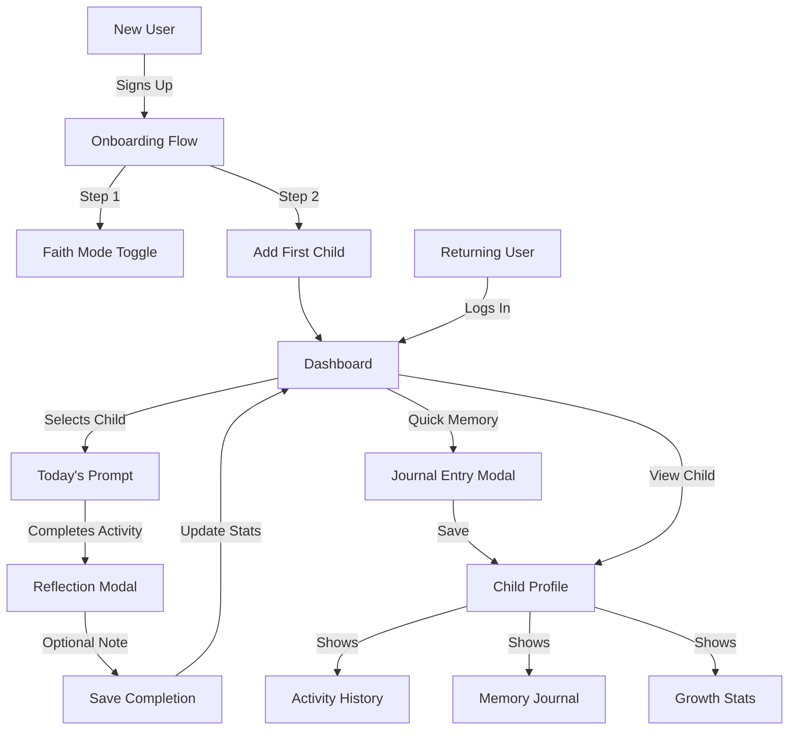
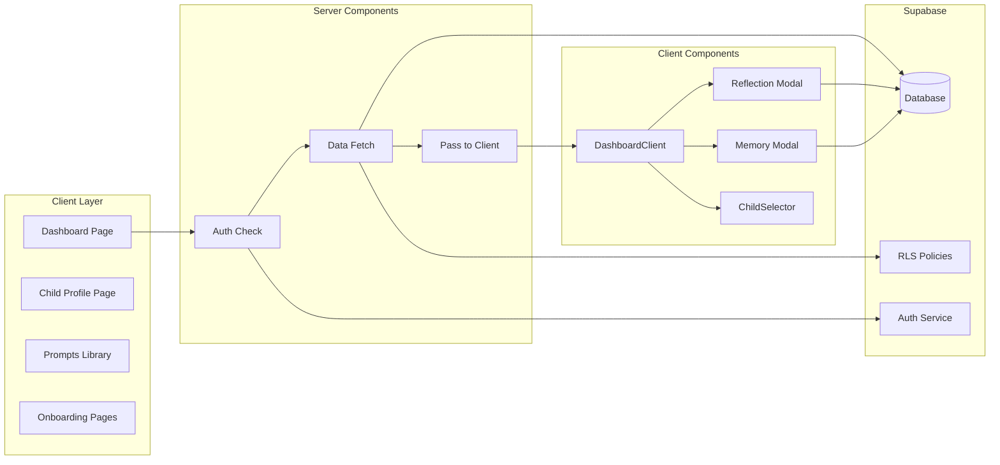
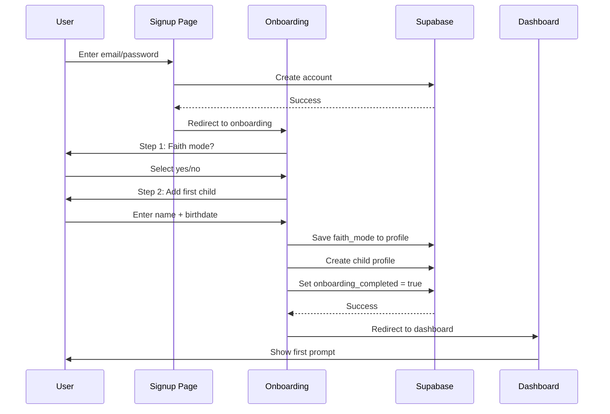
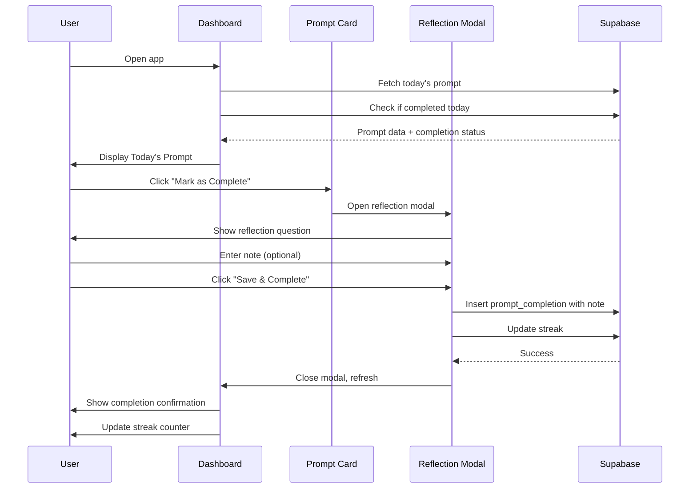
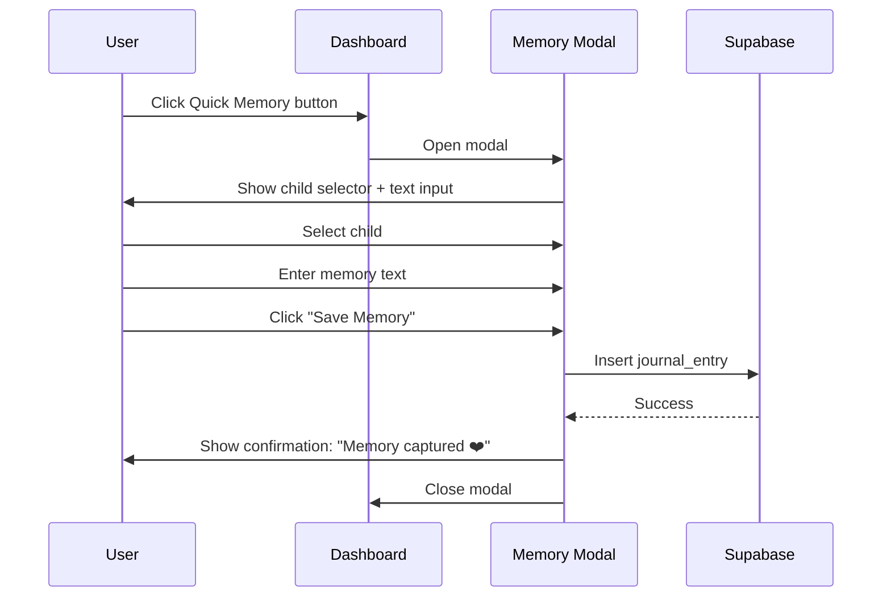

# Design Document: Demo-Ready MVP

## Overview

This design builds on the existing Next.js parenting app architecture to deliver a polished, demo-ready experience in 3 days. The app already has authentication, Stripe integration, child profiles, and a prompt library. This design focuses on refining the daily connection experience, adding meaningful reflection capture, implementing graceful onboarding, and ensuring production-ready deployment.

**Core Value Proposition**: Help parents create intentional, meaningful moments with their children through age-appropriate daily prompts, optional faith-based reflection, and gentle progress tracking.

**Timeline**: 3 days to demo (October 24, 2025)

## Architecture

### Technology Stack (Existing)
- **Framework**: Next.js 14.1.0 (App Router)
- **Database**: Supabase (PostgreSQL with RLS)
- **Authentication**: Supabase Auth (email/password)
- **Payments**: Stripe
- **Styling**: Tailwind CSS + custom utilities
- **Deployment**: Vercel
- **Language**: TypeScript (strict mode)

### Architectural Principles
1. **Server Components by Default**: Leverage Next.js server components for data fetching and auth checks
2. **Client Components for Interactivity**: Use 'use client' only for interactive UI (forms, buttons, state management)
3. **Database-Level Security**: Rely on Supabase RLS policies for all data access control
4. **Optimistic UI Updates**: Provide immediate feedback, then sync with server
5. **Mobile-First Design**: Prioritize mobile experience, enhance for desktop

## System Architecture

### High-Level Flow



### Data Flow Architecture



## Components and Interfaces

### New Components to Build

#### 1. OnboardingFlow Component
**Location**: `/components/OnboardingFlow.tsx`

**Purpose**: Guide new users through initial setup

**Interface**:
```typescript
interface OnboardingFlowProps {
  userId: string
  userEmail: string
}

interface OnboardingStep {
  id: number
  title: string
  description: string
  component: React.ReactNode
}
```

**State Management**:
```typescript
const [currentStep, setCurrentStep] = useState(0)
const [faithMode, setFaithMode] = useState(false)
const [childData, setChildData] = useState({ name: '', birthDate: '' })
const [isSubmitting, setIsSubmitting] = useState(false)
```

**Behavior**:
- Step 1: Faith mode toggle with explanation
- Step 2: Add first child (name + birthdate required)
- On completion: Save faith_mode to profile, create child, redirect to dashboard
- Progress indicator at top (1 of 2, 2 of 2)

#### 2. ReflectionModal Component
**Location**: `/components/ReflectionModal.tsx`

**Purpose**: Capture reflection after completing an activity

**Interface**:
```typescript
interface ReflectionModalProps {
  isOpen: boolean
  onClose: () => void
  promptId: string
  promptTitle: string
  childId: string | null
  faithMode: boolean
  onComplete: (notes?: string) => Promise<void>
}
```

**UI Elements**:
- Overlay with centered modal
- Prompt title reminder
- Faith-based question (if faithMode enabled): "What did this moment teach you about God's love?"
- Secular question (default): "How did it go? Any special moments?"
- Text area (optional, 500 char max)
- "Save & Complete" button
- "Skip Note" link (completes without reflection)

**Behavior**:
- Opens after "Mark as Complete" clicked
- Submits to prompt_completions table with optional notes
- Updates streak immediately
- Shows success message on save
- Closes and refreshes parent component

#### 3. QuickMemoryButton Component
**Location**: `/components/QuickMemoryButton.tsx`

**Purpose**: Floating action button for quick memory capture

**Interface**:
```typescript
interface QuickMemoryButtonProps {
  children: Child[]
  userId: string
}
```

**UI Elements**:
- Floating button (bottom-right, fixed position)
- Icon: 📝 or ❤️
- Accessible label
- Opens modal on click

#### 4. MemoryModal Component
**Location**: `/components/MemoryModal.tsx`

**Purpose**: Quick memory journal entry

**Interface**:
```typescript
interface MemoryModalProps {
  isOpen: boolean
  onClose: () => void
  children: Child[]
  userId: string
}
```

**UI Elements**:
- Child selector dropdown (required)
- Text area: "What made you smile today?" (500 char max)
- Optional emoji reactions (❤️ 😊 🎉 🤗 ✨)
- "Save Memory" button
- Character count display

**Behavior**:
- Saves to journal_entries table
- Shows confirmation: "Memory captured ❤️"
- Clears form after save
- Closes modal

#### 5. TodaysPromptCard Component
**Location**: `/components/TodaysPromptCard.tsx`

**Purpose**: Enhanced display of today's daily prompt

**Interface**:
```typescript
interface TodaysPromptCardProps {
  prompt: DailyPrompt | null
  childName: string
  childAge: number
  completedToday: boolean
  faithMode: boolean
  onComplete: () => void
}
```

**UI Elements**:
- Prominent "Today's Connection Moment" header
- Category badge (color-coded)
- Activity title (large, bold)
- Description
- Estimated time badge
- Age-appropriateness indicator
- "Mark as Complete" button (primary CTA)
- Completion confirmation if already done

**Styling**:
- Use `.card` class with gradient border
- Larger padding and text than library cards
- Animated entrance (fade-in)
- Completion state shows checkmark and encouraging message

#### 6. ChildGrowthStats Component
**Location**: `/components/ChildGrowthStats.tsx`

**Purpose**: Visual breakdown of activity distribution

**Interface**:
```typescript
interface ChildGrowthStatsProps {
  childId: string
  completions: PromptCompletion[]
}

interface CategoryBreakdown {
  category: string
  count: number
  percentage: number
  color: string
}
```

**UI Elements**:
- Horizontal bar chart showing category distribution
- Categories: Spiritual, Emotional, Physical, Academic, Social
- Percentage breakdown
- Gentle suggestion if imbalanced: "Try exploring [underrepresented category]!"

**Implementation**:
- Calculate category counts from completions
- Map categories to colors (spiritual: purple, emotional: pink, physical: green, academic: blue, social: orange)
- Render horizontal bars with widths based on percentage

#### 7. StreakEncouragement Component
**Location**: `/components/StreakEncouragement.tsx`

**Purpose**: Display streak with grace-filled messaging

**Interface**:
```typescript
interface StreakEncouragementProps {
  currentStreak: number
  longestStreak: number
  totalCompletions: number
  completedToday: boolean
  streakBroken: boolean
}
```

**Milestone Messages**:
- 7 days: "A full week of connection! 🎉"
- 14 days: "Two weeks of intentional moments!"
- 30 days: "One month of building something beautiful!"
- 60 days: "Your consistency is inspiring!"
- 90 days: "Three months of showing up for your child!"

**Broken Streak Message**:
- "That's okay—what matters is showing up. Your [X] total activities show your heart."
- Emphasize total completions over consecutive days

### Modified Existing Components

#### DashboardClient.tsx (Enhanced)
**New Additions**:
- Integration with TodaysPromptCard component
- Pass faithMode prop from profile
- Handle ReflectionModal state
- Display QuickMemoryButton
- Show StreakEncouragement component

**Changes**:
```typescript
// Add faith mode state
const [faithMode, setFaithMode] = useState(profile?.faith_mode || false)

// Add reflection modal state
const [reflectionOpen, setReflectionOpen] = useState(false)
const [completingPromptId, setCompletingPromptId] = useState<string | null>(null)

// Handle completion flow
const handleMarkComplete = (promptId: string) => {
  setCompletingPromptId(promptId)
  setReflectionOpen(true)
}
```

#### ChildCard.tsx (Enhanced)
**New Additions**:
- Display total completions badge
- Show current streak for child
- Link to detailed child profile page

#### ChildForm.tsx (Simplified for Onboarding)
**Create Simplified Version**: OnboardingChildForm.tsx
- Only name and birthdate required
- Interests/traits optional (can add later)
- Single-page form, no multi-step

## Data Models

### New Database Tables

#### journal_entries
```sql
CREATE TABLE journal_entries (
  id UUID PRIMARY KEY DEFAULT uuid_generate_v4(),
  user_id UUID NOT NULL REFERENCES auth.users(id) ON DELETE CASCADE,
  child_id UUID NOT NULL REFERENCES child_profiles(id) ON DELETE CASCADE,
  content TEXT NOT NULL CHECK (char_length(content) <= 500),
  emoji_reactions TEXT[] DEFAULT '{}',
  entry_date DATE NOT NULL DEFAULT CURRENT_DATE,
  created_at TIMESTAMP WITH TIME ZONE DEFAULT NOW()
);

-- RLS Policies
ALTER TABLE journal_entries ENABLE ROW LEVEL SECURITY;

CREATE POLICY "Users can view own journal entries"
  ON journal_entries FOR SELECT
  USING (auth.uid() = user_id);

CREATE POLICY "Users can create own journal entries"
  ON journal_entries FOR INSERT
  WITH CHECK (auth.uid() = user_id);

CREATE POLICY "Users can update own journal entries"
  ON journal_entries FOR UPDATE
  USING (auth.uid() = user_id);

CREATE POLICY "Users can delete own journal entries"
  ON journal_entries FOR DELETE
  USING (auth.uid() = user_id);

-- Indexes
CREATE INDEX idx_journal_entries_user_id ON journal_entries(user_id);
CREATE INDEX idx_journal_entries_child_id ON journal_entries(child_id);
CREATE INDEX idx_journal_entries_entry_date ON journal_entries(entry_date DESC);
```

### Modified Tables

#### profiles (Add Columns)
```sql
ALTER TABLE profiles
  ADD COLUMN faith_mode BOOLEAN DEFAULT FALSE,
  ADD COLUMN onboarding_completed BOOLEAN DEFAULT FALSE,
  ADD COLUMN onboarding_completed_at TIMESTAMP WITH TIME ZONE;
```

#### prompt_completions (Add Column for Reflection)
```sql
ALTER TABLE prompt_completions
  ADD COLUMN reflection_note TEXT CHECK (char_length(reflection_note) <= 500);
```

### Database Functions

#### get_child_completions
```sql
CREATE OR REPLACE FUNCTION get_child_completions(p_child_id UUID)
RETURNS TABLE (
  prompt_id UUID,
  completed_at TIMESTAMP WITH TIME ZONE,
  completion_date DATE,
  category TEXT,
  reflection_note TEXT
) AS $$
BEGIN
  RETURN QUERY
  SELECT
    pc.prompt_id,
    pc.completed_at,
    pc.completion_date,
    dp.category,
    pc.reflection_note
  FROM prompt_completions pc
  JOIN daily_prompts dp ON pc.prompt_id = dp.id
  WHERE pc.child_id = p_child_id
  ORDER BY pc.completed_at DESC;
END;
$$ LANGUAGE plpgsql SECURITY DEFINER;
```

#### get_category_breakdown
```sql
CREATE OR REPLACE FUNCTION get_category_breakdown(p_child_id UUID)
RETURNS TABLE (
  category TEXT,
  count BIGINT
) AS $$
BEGIN
  RETURN QUERY
  SELECT
    dp.category,
    COUNT(*) as count
  FROM prompt_completions pc
  JOIN daily_prompts dp ON pc.prompt_id = dp.id
  WHERE pc.child_id = p_child_id
  GROUP BY dp.category
  ORDER BY count DESC;
END;
$$ LANGUAGE plpgsql SECURITY DEFINER;
```

## User Experience Flow

### Onboarding Flow (New User)



### Daily Completion Flow



### Memory Capture Flow



## Error Handling

### Error Scenarios and Strategies

#### 1. Authentication Errors
**Scenario**: User session expires, invalid credentials, network issues

**Handling**:
- Catch auth errors in middleware and server components
- Redirect to `/signup` with error message
- Display user-friendly message: "Session expired. Please sign in again."
- Preserve attempted route in query param for post-login redirect

**Implementation**:
```typescript
try {
  const { data: { session } } = await supabase.auth.getSession()
  if (!session) {
    redirect(`/signup?redirectTo=${encodeURIComponent(pathname)}`)
  }
} catch (error) {
  redirect('/signup?error=session_expired')
}
```

#### 2. Database Operation Failures
**Scenario**: Insert/update fails, network timeout, RLS policy violation

**Handling**:
- Wrap all mutations in try-catch
- Display toast/alert with actionable message
- Log error for debugging (in production: send to error tracking service)
- Revert optimistic UI updates

**Implementation**:
```typescript
try {
  const { error } = await supabase
    .from('prompt_completions')
    .insert({ ... })

  if (error) throw error

  // Success: update UI
  setCompletedToday(true)
} catch (error: any) {
  console.error('Completion failed:', error)
  alert('Unable to save completion. Please try again.')
  setCompletedToday(false)
}
```

#### 3. Form Validation Errors
**Scenario**: Missing required fields, invalid date format, character limit exceeded

**Handling**:
- Client-side validation before submission
- Display inline error messages below fields
- Disable submit button until valid
- Server-side validation as backup (check constraints in DB)

**Implementation**:
```typescript
const validateChildForm = (data: ChildFormData): FormErrors => {
  const errors: FormErrors = {}

  if (!data.name.trim()) {
    errors.name = 'Name is required'
  }

  if (!data.birthDate) {
    errors.birthDate = 'Birth date is required'
  } else if (new Date(data.birthDate) > new Date()) {
    errors.birthDate = 'Birth date cannot be in the future'
  }

  return errors
}
```

#### 4. Stripe Payment Errors
**Scenario**: Card declined, network error, webhook failure

**Handling**:
- Display Stripe error messages to user
- Provide retry option
- Log webhook failures for manual review
- Send email notification for failed payments

**Current Implementation** (already exists):
```typescript
// In /api/checkout
if (error) {
  return NextResponse.json(
    { error: 'Failed to create checkout session' },
    { status: 500 }
  )
}
```

#### 5. Deployment/Build Errors
**Scenario**: TypeScript errors, missing env vars, build timeout

**Handling**:
- **Pre-deploy**: Run `npm run build` locally to catch errors
- **Env vars**: Validate all required vars in `next.config.js`
- **Type errors**: Enable strict TypeScript, fix all errors before push
- **Timeout**: Optimize imports, reduce bundle size

**Validation Script**:
```typescript
// In next.config.js
const requiredEnvVars = [
  'NEXT_PUBLIC_SUPABASE_URL',
  'NEXT_PUBLIC_SUPABASE_ANON_KEY',
  'STRIPE_SECRET_KEY',
]

requiredEnvVars.forEach((envVar) => {
  if (!process.env[envVar]) {
    throw new Error(`Missing required environment variable: ${envVar}`)
  }
})
```

### Error Monitoring (Post-Demo Enhancement)
- Integrate Sentry or similar for production error tracking
- Set up Slack/email alerts for critical errors
- Monitor Vercel deployment logs
- Track Stripe webhook failures

## Testing Strategy

### Testing Priorities (3-Day Timeline)

Given the tight timeline, focus on **manual testing** and **smoke tests** rather than comprehensive automated testing.

#### 1. Manual Testing Checklist

**Authentication Flow**:
- [ ] Sign up with new email
- [ ] Sign in with existing email
- [ ] Sign out and verify session cleared
- [ ] Access protected route without auth (should redirect)
- [ ] Verify middleware refreshes session

**Onboarding Flow**:
- [ ] Complete full onboarding (faith mode + add child)
- [ ] Verify onboarding doesn't show again
- [ ] Skip onboarding (if user has children already)
- [ ] Test with faith mode enabled
- [ ] Test with faith mode disabled

**Daily Prompt Flow**:
- [ ] View today's prompt for infant child
- [ ] View today's prompt for elementary child
- [ ] Mark prompt as complete
- [ ] Verify reflection modal opens
- [ ] Submit reflection with note
- [ ] Submit reflection without note
- [ ] Verify streak increments
- [ ] Complete activity twice in same day (should prevent)

**Memory Journal**:
- [ ] Open quick memory modal
- [ ] Select child and enter text
- [ ] Save memory
- [ ] View memory in child profile
- [ ] Test 500 character limit

**Child Profiles**:
- [ ] Add new child
- [ ] Edit existing child
- [ ] View child profile page
- [ ] Verify age calculation correct
- [ ] View activity history
- [ ] View category breakdown

**Stripe Integration**:
- [ ] Initiate checkout (test mode)
- [ ] Complete payment with test card
- [ ] Verify subscription_status updates
- [ ] Access customer portal
- [ ] Cancel subscription
- [ ] Verify webhook handling

**Responsive Design**:
- [ ] Test on iPhone (Safari)
- [ ] Test on Android (Chrome)
- [ ] Test on desktop (Chrome, Firefox, Safari)
- [ ] Verify mobile navigation works
- [ ] Test touch interactions

#### 2. Smoke Tests (Quick Validation)

**Build Test**:
```bash
npm run build
```
- Verify build completes without errors
- Check for TypeScript errors
- Verify no console warnings

**Database Test**:
```sql
-- Verify all tables exist
SELECT table_name FROM information_schema.tables
WHERE table_schema = 'public';

-- Test RLS policies
-- (Run queries as different users to verify isolation)
```

**Environment Test**:
```bash
# Verify all env vars set
node -e "
  const required = ['NEXT_PUBLIC_SUPABASE_URL', 'STRIPE_SECRET_KEY'];
  required.forEach(v => {
    if (!process.env[v]) console.error('Missing:', v);
  });
"
```

#### 3. User Acceptance Testing (Day Before Demo)

**Test Scenarios**:
1. **New Parent Journey**: Sign up → onboard → complete first activity → add memory
2. **Multi-Child Parent**: Add 2 children of different ages → verify age-appropriate prompts
3. **Streak Building**: Complete activities on consecutive days → verify streak counter
4. **Faith Mode**: Enable faith mode → complete activity → verify spiritual question shown
5. **Free Tier**: Use app without upgrading → verify all core features accessible

**Success Criteria**:
- User can complete entire flow without assistance
- No confusing error messages
- UI feels polished and intentional
- Loading states feel responsive (< 2 seconds)

#### 4. Performance Testing

**Metrics to Verify**:
- Dashboard page load: < 2 seconds
- Database queries: < 500ms
- Build time: < 5 minutes
- Lighthouse score: > 80 on mobile

**Quick Performance Check**:
```bash
# In Chrome DevTools
# - Open dashboard
# - Network tab → verify total load time
# - Lighthouse tab → run audit
```

### Post-Demo Testing (Future)

**Automated Testing** (after demo):
- Set up Playwright for E2E tests
- Add Vitest for unit tests on utilities
- Test database functions in Supabase
- Set up CI/CD with automated tests

## Deployment Configuration

### Vercel Setup

#### Project Configuration

**Framework Preset**: Next.js

**Build Command**: `next build` (default)

**Output Directory**: `.next` (default)

**Install Command**: `npm install` (default)

**Node Version**: 18.x (specify in package.json)

```json
// In package.json
{
  "engines": {
    "node": ">=18.0.0"
  }
}
```

#### Environment Variables (Production)

**Required Variables**:
```
NEXT_PUBLIC_SUPABASE_URL=https://your-project.supabase.co
NEXT_PUBLIC_SUPABASE_ANON_KEY=your-anon-key
STRIPE_SECRET_KEY=sk_live_...
STRIPE_PUBLISHABLE_KEY=pk_live_...
STRIPE_WEBHOOK_SECRET=whsec_...
STRIPE_PRICE_ID_MONTHLY=price_...
STRIPE_PRICE_ID_YEARLY=price_...
NEXT_PUBLIC_APP_URL=https://your-app.vercel.app
```

**How to Set**:
1. Vercel Dashboard → Project → Settings → Environment Variables
2. Add each variable individually
3. Select "Production" environment
4. Also add to "Preview" for testing

#### Domain Configuration

**Custom Domain** (optional):
- Add domain in Vercel Dashboard
- Update DNS records as instructed
- Update `NEXT_PUBLIC_APP_URL` to custom domain
- Update Stripe webhook URL to custom domain

#### Deployment Process

**Automatic Deployments**:
- Push to `main` branch → auto-deploy to production
- Push to other branches → auto-deploy to preview

**Manual Deployment**:
```bash
# Install Vercel CLI
npm i -g vercel

# Deploy
vercel --prod
```

**Pre-Deployment Checklist**:
- [ ] Run `npm run build` locally (verify no errors)
- [ ] Run TypeScript check: `npx tsc --noEmit`
- [ ] Verify all env vars set in Vercel
- [ ] Test Stripe webhook endpoint
- [ ] Verify Supabase RLS policies active
- [ ] Check database migrations applied

### Stripe Webhook Configuration

**Webhook URL**: `https://your-app.vercel.app/api/webhook`

**Events to Listen For**:
- `checkout.session.completed`
- `customer.subscription.created`
- `customer.subscription.updated`
- `customer.subscription.deleted`

**Setup Steps**:
1. Stripe Dashboard → Developers → Webhooks
2. Add endpoint with production URL
3. Select events
4. Copy webhook signing secret
5. Add to Vercel env vars as `STRIPE_WEBHOOK_SECRET`

**Testing Webhooks**:
```bash
# Use Stripe CLI for local testing
stripe listen --forward-to localhost:3000/api/webhook
stripe trigger checkout.session.completed
```

### Supabase Configuration

**Database Migrations**:
- All migrations in `/supabase/migrations/` are version-controlled
- Apply to production via Supabase Dashboard or CLI

**Apply Migrations**:
```bash
# Using Supabase CLI
supabase db push
```

**Environment Setup**:
- Production database URL in Vercel env vars
- RLS policies enabled on all tables
- Auth settings configured (email confirmation, password requirements)

**Auth Redirect URLs** (Supabase Dashboard):
- Add production URL: `https://your-app.vercel.app/api/auth/callback`
- Add preview URLs: `https://*-your-project.vercel.app/api/auth/callback`

### Build Optimization

**Next.js Configuration**:
```javascript
// next.config.js
module.exports = {
  reactStrictMode: true,

  // Optimize images
  images: {
    domains: ['your-supabase-project.supabase.co'],
    formats: ['image/avif', 'image/webp'],
  },

  // Environment variable validation
  env: {
    NEXT_PUBLIC_SUPABASE_URL: process.env.NEXT_PUBLIC_SUPABASE_URL,
    NEXT_PUBLIC_SUPABASE_ANON_KEY: process.env.NEXT_PUBLIC_SUPABASE_ANON_KEY,
  },

  // Analytics
  experimental: {
    instrumentationHook: true,
  },
}
```

**Bundle Size Optimization**:
- Use dynamic imports for heavy components
- Remove unused dependencies
- Enable tree-shaking (automatic with Next.js)

```typescript
// Dynamic import example
const HeavyComponent = dynamic(() => import('@/components/HeavyComponent'), {
  loading: () => <p>Loading...</p>,
})
```

### Monitoring and Logging

**Vercel Analytics** (already installed):
- Track page views
- Monitor Core Web Vitals
- View in Vercel Dashboard → Analytics

**Supabase Logs**:
- Monitor database queries in Supabase Dashboard
- Check for slow queries (> 1 second)
- Review auth logs for failed attempts

**Stripe Logs**:
- Monitor payments in Stripe Dashboard
- Check webhook delivery status
- Review failed payments

### Rollback Strategy

**If Deployment Fails**:
1. Vercel automatically keeps previous deployment active
2. Revert via Vercel Dashboard → Deployments → "Promote to Production"
3. Or redeploy previous commit:
   ```bash
   git revert HEAD
   git push
   ```

**If Database Migration Fails**:
1. Rollback migration in Supabase
2. Fix migration file
3. Re-apply migration

### Performance Targets

**Production Metrics**:
- First Contentful Paint: < 1.5s
- Time to Interactive: < 3s
- Lighthouse Performance Score: > 80
- Lighthouse Accessibility Score: > 90

**Verify After Deployment**:
```bash
# Run Lighthouse audit on production URL
npx lighthouse https://your-app.vercel.app --view
```

## Code Review Requirements

### AI Code Review Specification

**Prompt for Claude Code**:
```
How many lines of code is my app? How well designed is the app on a scale of 1-10? Would this stand up in a world-class engineering shop? Save your response in a .md file
```

**Review Criteria**:
1. **Lines of Code**: Count all TypeScript/TSX files (exclude node_modules)
2. **Architecture Rating (1-10)**: Evaluate component structure, separation of concerns, code organization
3. **Code Quality (1-10)**: TypeScript usage, error handling, type safety
4. **Database Design (1-10)**: Schema design, RLS policies, indexes, function efficiency
5. **Security (1-10)**: Auth implementation, data validation, environment variable handling
6. **Performance (1-10)**: Query optimization, bundle size, lazy loading
7. **Maintainability (1-10)**: Code readability, commenting, file organization
8. **Scalability (1-10)**: Can it handle 10x users? 100x?

**Output Format** (CODE_REVIEW.md):
```markdown
# Code Review: The Next 5 Minutes Parenting App

## Overview
Total Lines of Code: [X]
Overall Design Rating: [X]/10

## World-Class Engineering Assessment
[Would this stand up in a world-class engineering shop? Detailed explanation]

## Detailed Analysis

### Architecture (X/10)
[Analysis]

### Code Quality (X/10)
[Analysis]

### Database Design (X/10)
[Analysis]

### Security (X/10)
[Analysis]

### Performance (X/10)
[Analysis]

### Maintainability (X/10)
[Analysis]

### Scalability (X/10)
[Analysis]

## Strengths
- [Strength 1]
- [Strength 2]
...

## Areas for Improvement
- [Improvement 1]
- [Improvement 2]
...

## Recommendations
1. [Actionable recommendation]
2. [Actionable recommendation]
...
```

### Review Execution
- Run review on Day 3 (morning of demo day)
- Generate report using Claude Code
- Review findings and address critical issues
- Include report in demo presentation

## Implementation Phases

### Day 1: Foundation & Onboarding
**Goal**: Set up data models and onboarding flow

**Tasks**:
1. Create database migration for journal_entries table
2. Add faith_mode and onboarding_completed columns to profiles
3. Add reflection_note column to prompt_completions
4. Build OnboardingFlow component
5. Build OnboardingChildForm component (simplified)
6. Create /onboarding route
7. Update signup flow to redirect to onboarding
8. Test onboarding flow end-to-end

**Deliverable**: New users can complete onboarding and see dashboard

### Day 2: Daily Connection & Reflection
**Goal**: Polish core experience with reflection and memory capture

**Tasks**:
1. Build ReflectionModal component
2. Build TodaysPromptCard component
3. Build QuickMemoryButton and MemoryModal components
4. Integrate reflection modal into DashboardClient
5. Update completion flow to use new modal
6. Add memory journal display to child profile page
7. Build ChildGrowthStats component
8. Test completion flow with reflection
9. Test memory capture

**Deliverable**: Users can complete activities with reflection and capture memories

### Day 3: Polish, Deploy, Review
**Goal**: Production-ready deployment and code review

**Tasks**:
1. Build StreakEncouragement component
2. Add streak milestone messaging
3. Enhance child profile page with stats
4. Fix any TypeScript errors
5. Run full manual testing checklist
6. Deploy to Vercel
7. Verify production deployment
8. Run AI code review
9. Address any critical issues
10. Final testing on production

**Deliverable**: Deployed app with code review report

## Future Enhancements (Post-Demo)

### Phase 2 Features
1. **Voice Notes**: Add audio recording to memory journal
2. **Photo Uploads**: Allow photo attachments to memories
3. **On This Day**: Show memories from previous years
4. **Weekly Summary**: Email digest of week's activities
5. **Partner Sharing**: Invite spouse to collaborate

### Phase 3 Features
1. **Community Feed**: Share wins with other parents
2. **Custom Activities**: User-generated prompts
3. **AI Summaries**: Monthly recap of child's growth
4. **Advanced Analytics**: Detailed charts and insights
5. **Premium Expert Content**: Faith + psychology packs

### Technical Debt to Address
1. Add comprehensive E2E tests
2. Set up error monitoring (Sentry)
3. Optimize database queries (add indexes)
4. Implement caching strategy (React Query)
5. Add API rate limiting
6. Set up staging environment

## Security Considerations

### Data Privacy
- All child data encrypted at rest (Supabase default)
- RLS policies enforce user isolation
- No personal data exposed in URLs
- HTTPS enforced on all connections

### Authentication Security
- Password requirements enforced by Supabase
- Session tokens rotated on each request
- CSRF protection via Supabase SSR
- Rate limiting on auth endpoints (Supabase default)

### Payment Security
- PCI compliance via Stripe
- Never store card details
- Webhook signature verification
- Stripe customer portal for subscription management

### Environment Variable Security
- Never commit .env files (in .gitignore)
- Use Vercel environment variables for secrets
- Separate keys for dev/staging/production
- Rotate keys periodically

## Accessibility

### WCAG 2.1 AA Compliance

**Interactive Elements**:
- All buttons have accessible labels
- Form inputs have associated labels
- Focus states visible on all interactive elements
- Color contrast ratio ≥ 4.5:1 for text

**Keyboard Navigation**:
- All features accessible via keyboard
- Modal traps focus when open
- Tab order follows visual layout
- Skip links for main content

**Screen Reader Support**:
- Semantic HTML elements
- ARIA labels where needed
- Alt text for images
- Form error announcements

**Mobile Accessibility**:
- Touch targets ≥ 44x44px
- Pinch-to-zoom enabled
- No horizontal scrolling
- Responsive text sizing

## Conclusion

This design document provides a comprehensive blueprint for delivering a demo-ready MVP in 3 days. The architecture builds on existing patterns, prioritizes user experience, and ensures production-quality deployment. By focusing on the core value proposition—intentional family connection—and implementing with grace-filled design (streaks without guilt, faith as optional), this app will stand out as a thoughtfully crafted product in the parenting space.

**Next Steps**: Proceed to implementation tasks based on the 3-day phased approach outlined above.
