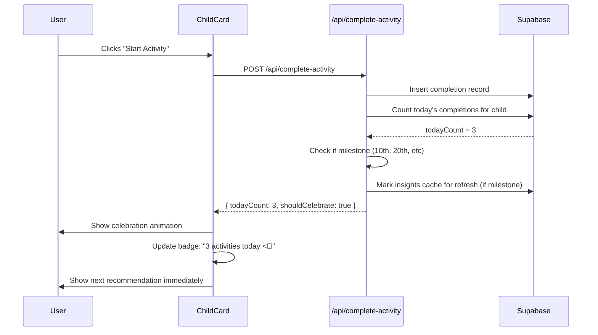
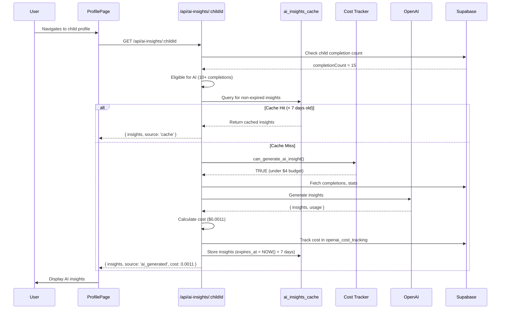
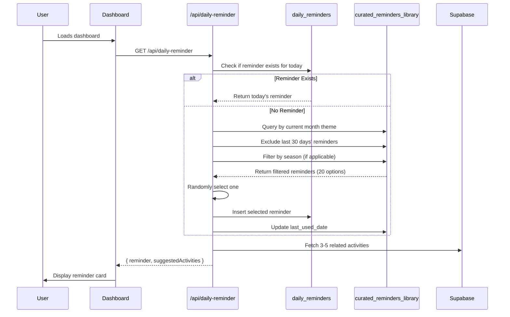

# Enhanced Profile Cards with AI Insights - Design Document

## Overview

This feature enhances the child profile cards with unlimited daily activities, AI-powered personalized insights, and curated daily reminders. The design prioritizes cost efficiency (strict $4/month OpenAI budget), performance (7-day caching), and graceful degradation (fallbacks for all AI features).

### Key Design Principles

1. **Cost-First Architecture**: All AI features designed with budget constraints as primary consideration
2. **Cache-Heavy Strategy**: 7-day cache duration with 85%+ hit rate target
3. **Graceful Degradation**: Rule-based fallbacks for all AI features
4. **Performance Optimized**: Non-blocking AI generation, optimistic UI updates
5. **User Experience Priority**: Never show loading states or errors for AI features

---

## System Architecture

### High-Level Architecture Diagram

```mermaid
graph TB
    subgraph Client["Client (React)"]
        Dashboard[Dashboard Page]
        ChildCard[Enhanced Child Card]
        ProfilePage[Child Profile Page]
        ReminderCard[Daily Reminder Card]
        InsightsSection[AI Insights Section]
    end

    subgraph Server["Server (Next.js)"]
        DashboardAPI[Dashboard API Route]
        InsightsAPI[/api/ai-insights]
        ReminderAPI[/api/daily-reminder]
        CompletionAPI[/api/complete-activity]
    end

    subgraph AI["AI Services"]
        InsightGenerator[Insight Generator]
        OpenAI[OpenAI GPT-3.5-turbo]
        CostTracker[Cost Tracker]
        ReminderLibrary[Curated Reminder Library]
    end

    subgraph Database["Supabase Database"]
        Completions[(prompt_completions)]
        Children[(child_profiles)]
        InsightsCache[(ai_insights_cache)]
        RemindersTable[(daily_reminders)]
        CostTracking[(openai_cost_tracking)]
    end

    Dashboard --> DashboardAPI
    ChildCard --> CompletionAPI
    ProfilePage --> InsightsAPI
    ReminderCard --> ReminderAPI

    DashboardAPI --> Children
    DashboardAPI --> Completions
    DashboardAPI --> RemindersTable

    CompletionAPI --> Completions
    CompletionAPI -.trigger.-> InsightGenerator

    InsightsAPI --> InsightsCache
    InsightsAPI --> InsightGenerator

    InsightGenerator --> CostTracker
    InsightGenerator --> OpenAI
    InsightGenerator --> InsightsCache

    ReminderAPI --> RemindersTable
    ReminderAPI --> ReminderLibrary

    CostTracker --> CostTracking
```

---

## Database Schema

### New Tables

#### 1. `ai_insights_cache`

Stores generated AI insights with 7-day expiration.

```sql
CREATE TABLE ai_insights_cache (
  id UUID PRIMARY KEY DEFAULT uuid_generate_v4(),
  child_id UUID NOT NULL REFERENCES child_profiles(id) ON DELETE CASCADE,
  user_id UUID NOT NULL REFERENCES profiles(id) ON DELETE CASCADE,
  insights JSONB NOT NULL, -- Array of insight objects
  generated_at TIMESTAMP WITH TIME ZONE NOT NULL DEFAULT NOW(),
  expires_at TIMESTAMP WITH TIME ZONE NOT NULL, -- generated_at + 7 days
  completion_count INTEGER NOT NULL, -- Number of completions at generation time
  generation_cost DECIMAL(10, 6) NOT NULL, -- Cost in USD
  model_used TEXT NOT NULL, -- 'gpt-3.5-turbo'
  prompt_tokens INTEGER NOT NULL,
  completion_tokens INTEGER NOT NULL,
  total_tokens INTEGER NOT NULL,
  created_at TIMESTAMP WITH TIME ZONE NOT NULL DEFAULT NOW(),
  updated_at TIMESTAMP WITH TIME ZONE NOT NULL DEFAULT NOW()
);

-- Indexes
CREATE INDEX idx_ai_insights_child_id ON ai_insights_cache(child_id);
CREATE INDEX idx_ai_insights_user_id ON ai_insights_cache(user_id);
CREATE INDEX idx_ai_insights_expires_at ON ai_insights_cache(expires_at);

-- Auto-delete expired insights
CREATE OR REPLACE FUNCTION delete_expired_insights()
RETURNS void AS $$
BEGIN
  DELETE FROM ai_insights_cache WHERE expires_at < NOW();
END;
$$ LANGUAGE plpgsql;

-- Scheduled cleanup (run daily via cron job)
-- SELECT cron.schedule('delete-expired-insights', '0 2 * * *', 'SELECT delete_expired_insights()');

-- JSONB structure for insights field:
-- [
--   {
--     "type": "pattern_recognition",
--     "message": "You tend to connect most with Emma during...",
--     "priority": 90,
--     "category": "consistency"
--   },
--   {
--     "type": "celebration",
--     "message": "You're doing an amazing job with...",
--     "priority": 85,
--     "category": "strengths"
--   }
-- ]
```

#### 2. `daily_reminders`

Stores daily reminder messages (one per day, shared across all users).

```sql
CREATE TABLE daily_reminders (
  id UUID PRIMARY KEY DEFAULT uuid_generate_v4(),
  reminder_date DATE UNIQUE NOT NULL,
  message TEXT NOT NULL, -- Main message (1-2 sentences)
  reminder_type TEXT NOT NULL CHECK (reminder_type IN (
    'reflective_question',
    'practical_offer',
    'conversation_starter',
    'research_insight',
    'challenge'
  )),
  expanded_guidance TEXT NOT NULL, -- Full guidance (2-3 paragraphs)
  related_categories TEXT[] NOT NULL, -- Activity categories that fit this theme
  icon TEXT NOT NULL, -- Single emoji
  theme TEXT NOT NULL, -- Monthly theme (e.g., 'connection_planning', 'emotional_attunement')
  source TEXT NOT NULL DEFAULT 'library', -- 'library' (curated) or 'ai' (future)
  created_at TIMESTAMP WITH TIME ZONE NOT NULL DEFAULT NOW()
);

-- Index
CREATE INDEX idx_daily_reminders_date ON daily_reminders(reminder_date);

-- Ensure only one reminder per day
CREATE UNIQUE INDEX idx_daily_reminders_unique_date ON daily_reminders(reminder_date);
```

#### 3. `openai_cost_tracking`

Tracks OpenAI API costs with monthly budget enforcement.

```sql
CREATE TABLE openai_cost_tracking (
  id UUID PRIMARY KEY DEFAULT uuid_generate_v4(),
  request_date DATE NOT NULL,
  request_type TEXT NOT NULL, -- 'ai_insight', 'daily_reminder' (future)
  model_used TEXT NOT NULL,
  prompt_tokens INTEGER NOT NULL,
  completion_tokens INTEGER NOT NULL,
  total_tokens INTEGER NOT NULL,
  cost_usd DECIMAL(10, 6) NOT NULL,
  user_id UUID REFERENCES profiles(id) ON DELETE SET NULL, -- NULL for system-wide requests
  child_id UUID REFERENCES child_profiles(id) ON DELETE SET NULL,
  success BOOLEAN NOT NULL DEFAULT TRUE,
  error_message TEXT,
  created_at TIMESTAMP WITH TIME ZONE NOT NULL DEFAULT NOW()
);

-- Indexes
CREATE INDEX idx_openai_cost_date ON openai_cost_tracking(request_date);
CREATE INDEX idx_openai_cost_type ON openai_cost_tracking(request_type);

-- Function to get current month spend
CREATE OR REPLACE FUNCTION get_monthly_openai_cost()
RETURNS DECIMAL(10, 6) AS $$
BEGIN
  RETURN (
    SELECT COALESCE(SUM(cost_usd), 0)
    FROM openai_cost_tracking
    WHERE request_date >= DATE_TRUNC('month', CURRENT_DATE)
      AND success = TRUE
  );
END;
$$ LANGUAGE plpgsql;

-- Function to check if budget allows new request
CREATE OR REPLACE FUNCTION can_generate_ai_insight()
RETURNS BOOLEAN AS $$
DECLARE
  current_spend DECIMAL(10, 6);
  budget_limit DECIMAL(10, 6) := 4.00; -- $4/month
BEGIN
  current_spend := get_monthly_openai_cost();
  RETURN current_spend < budget_limit;
END;
$$ LANGUAGE plpgsql;
```

#### 4. `curated_reminders_library`

Master library of pre-written daily reminders.

```sql
CREATE TABLE curated_reminders_library (
  id UUID PRIMARY KEY DEFAULT uuid_generate_v4(),
  message TEXT NOT NULL,
  reminder_type TEXT NOT NULL,
  expanded_guidance TEXT NOT NULL,
  related_categories TEXT[] NOT NULL,
  icon TEXT NOT NULL,
  theme TEXT NOT NULL,
  seasonal_tags TEXT[], -- ['spring', 'back_to_school', etc]
  last_used_date DATE, -- Track when this was last shown
  use_count INTEGER NOT NULL DEFAULT 0,
  quality_rating INTEGER CHECK (quality_rating >= 1 AND quality_rating <= 5),
  created_at TIMESTAMP WITH TIME ZONE NOT NULL DEFAULT NOW(),
  updated_at TIMESTAMP WITH TIME ZONE NOT NULL DEFAULT NOW()
);

-- Index
CREATE INDEX idx_curated_reminders_theme ON curated_reminders_library(theme);
CREATE INDEX idx_curated_reminders_last_used ON curated_reminders_library(last_used_date);
```

### Modified Tables

#### `prompt_completions` (existing)

No schema changes needed. Already tracks:
- `child_id` (for per-child tracking)
- `completion_date` (for daily activity counts)
- `duration_seconds` (for engagement analysis)
- `reflection_note` (for insight generation)

---

## Component Architecture

### New Components

#### 1. `EnhancedChildCard.tsx`

Enhanced version of existing ChildCard with activity count, AI insight teaser, and quick stats.

**Props:**
```typescript
interface EnhancedChildCardProps {
  child: Child
  recommendations: ScoredPrompt[]
  todayActivityCount: number // NEW
  weeklyActivityCount: number // NEW
  monthlyMinutes: number // NEW
  currentStreak: number
  aiInsightTeaser?: string // First 15 words of top insight
  onStartActivity: (promptId: string, childId: string) => void
  completedPromptIds: string[] // Recently completed (last 2 hours)
}
```

**Key Features:**
- Activity count badge with color psychology (0: gray, 1: blue, 2: purple, 3+: gold)
- Expandable AI insight teaser on hover
- Quick stats footer
- Celebration animation for 3+ activities

#### 2. `AIInsightsSection.tsx`

Displays AI-generated insights on child profile page.

**Props:**
```typescript
interface AIInsightsSectionProps {
  childId: string
  insights: AIInsight[] | null
  isLoading: boolean
  error?: string
  onRefresh: () => void // Only enabled if 7+ days since last generation
  eligibleForAI: boolean // True if child has 10+ completions
}

interface AIInsight {
  type: 'pattern_recognition' | 'celebration' | 'gentle_guidance' | 'developmental' | 'deepening'
  message: string
  priority: number
  category: string
}
```

**Key Features:**
- Shows 2-3 insights sorted by priority
- Graceful empty state for non-eligible children (<10 completions)
- Fallback to rule-based tips if AI fails
- "Refresh Insights" button (disabled if <7 days)
- Clear "AI-powered" label

#### 3. `DailyReminderCard.tsx`

Displays daily general reminder at top of dashboard.

**Props:**
```typescript
interface DailyReminderCardProps {
  reminder: DailyReminder
  onHelpClick: () => void
  onDismiss: () => void
}

interface DailyReminder {
  id: string
  message: string
  reminderType: 'reflective_question' | 'practical_offer' | 'conversation_starter' | 'research_insight' | 'challenge'
  expandedGuidance: string
  relatedCategories: string[]
  icon: string
  theme: string
}
```

**Key Features:**
- Prominent positioning at dashboard top
- Gradient background with theme icon
- "Help me with this" button
- Dismissible (persists dismissal in localStorage for 24 hours)
- Modal with expanded guidance

#### 4. `ReminderGuidanceModal.tsx`

Modal showing expanded guidance when user clicks "Help me with this".

**Props:**
```typescript
interface ReminderGuidanceModalProps {
  reminder: DailyReminder
  isOpen: boolean
  onClose: () => void
  suggestedActivities: Prompt[] // Activities from related categories
}
```

**Key Features:**
- Expanded guidance (2-3 paragraphs)
- Actionable steps (bullet list)
- 3-5 suggested activities from library
- "Add to Calendar" button (optional)

---

## API Design

### New API Routes

#### 1. `GET /api/ai-insights/:childId`

Retrieves or generates AI insights for a specific child.

**Request:**
```typescript
// Query params
{
  forceRefresh?: boolean // Only works if 7+ days since last generation
}
```

**Response:**
```typescript
{
  insights: AIInsight[] | null
  source: 'cache' | 'ai_generated' | 'rule_based_fallback'
  generatedAt: string // ISO timestamp
  expiresAt: string // ISO timestamp
  eligibleForAI: boolean
  nextRefreshAvailable: string // ISO timestamp (generated_at + 7 days)
  costIncurred: number // USD, only if newly generated
}
```

**Logic:**
1. Check if child has 10+ completions (eligibility)
2. If not eligible ’ return rule-based tips
3. Check cache for non-expired insights (<7 days old)
4. If cached ’ return cached insights
5. Check monthly budget (`can_generate_ai_insight()`)
6. If budget exceeded ’ return rule-based tips
7. Generate AI insights via OpenAI
8. Store in cache with 7-day expiration
9. Track cost in `openai_cost_tracking`
10. Return insights

**Error Handling:**
- OpenAI API failure ’ Fallback to rule-based tips
- Budget exceeded ’ Fallback to rule-based tips
- Database error ’ Return error with fallback tips

#### 2. `GET /api/daily-reminder`

Retrieves today's daily reminder (creates if doesn't exist).

**Response:**
```typescript
{
  reminder: DailyReminder
  suggestedActivities: Prompt[] // 3-5 activities from related categories
}
```

**Logic:**
1. Check if reminder exists for today
2. If exists ’ return it
3. If not ’ select from curated library:
   - Get current month's theme
   - Filter by theme
   - Exclude last 30 days' reminders
   - Prefer seasonal matches if available
   - Select randomly from filtered set
4. Insert into `daily_reminders` table
5. Update `last_used_date` in library
6. Fetch 3-5 suggested activities from related categories
7. Return reminder + activities

#### 3. `POST /api/complete-activity`

Enhanced completion endpoint that triggers insight cache invalidation.

**Request:**
```typescript
{
  promptId: string
  childId: string
  reflectionNote?: string
  durationSeconds?: number
}
```

**Response:**
```typescript
{
  completion: Completion
  todayActivityCount: number // Updated count for this child today
  shouldInvalidateInsights: boolean // True if milestone reached (10, 20, 30, etc)
}
```

**Logic:**
1. Create completion record (existing logic)
2. Count today's activities for this child
3. Check if this completion is a milestone (10th, 20th, 30th, etc)
4. If milestone ’ mark insights cache for regeneration
5. Return completion + metadata

#### 4. `GET /api/openai-cost-summary`

Admin endpoint for monitoring OpenAI costs.

**Response:**
```typescript
{
  currentMonthSpend: number // USD
  budgetLimit: number // 4.00
  remainingBudget: number // budgetLimit - currentMonthSpend
  requestsThisMonth: number
  avgCostPerRequest: number
  lastRequestDate: string
  canGenerateMore: boolean
}
```

---

## AI Integration

### OpenAI Service Layer

#### File: `lib/ai-insights.ts`

```typescript
import OpenAI from 'openai'
import { createClient } from '@supabase/supabase-js'

const openai = new OpenAI({
  apiKey: process.env.OPENAI_API_KEY || '',
})

interface InsightGenerationContext {
  child: Child
  completions: Completion[]
  stats: {
    totalCompletions: number
    categoryDistribution: { category: string; percentage: number }[]
    avgDuration: number
    reflectionRate: number
    consistencyPattern: string // 'weekday_mornings', 'weekend_evenings', etc
  }
}

export async function generateAIInsights(
  context: InsightGenerationContext,
  supabase: SupabaseClient
): Promise<{
  insights: AIInsight[]
  cost: number
  tokens: { prompt: number; completion: number; total: number }
}> {
  // 1. Check budget
  const canGenerate = await checkBudget(supabase)
  if (!canGenerate) {
    throw new Error('BUDGET_EXCEEDED')
  }

  // 2. Build prompt
  const prompt = buildInsightPrompt(context)

  // 3. Call OpenAI
  const response = await openai.chat.completions.create({
    model: 'gpt-3.5-turbo',
    messages: [
      {
        role: 'system',
        content: INSIGHT_SYSTEM_PROMPT
      },
      {
        role: 'user',
        content: prompt
      }
    ],
    temperature: 0.7,
    max_tokens: 300
  })

  // 4. Parse response
  const insights = parseInsightResponse(response.choices[0].message.content)

  // 5. Calculate cost
  const cost = calculateCost(response.usage)

  // 6. Track cost
  await trackCost(supabase, {
    model: 'gpt-3.5-turbo',
    promptTokens: response.usage.prompt_tokens,
    completionTokens: response.usage.completion_tokens,
    cost,
    childId: context.child.id
  })

  return {
    insights,
    cost,
    tokens: {
      prompt: response.usage.prompt_tokens,
      completion: response.usage.completion_tokens,
      total: response.usage.total_tokens
    }
  }
}

function calculateCost(usage: any): number {
  // GPT-3.5-turbo pricing: $0.001/1K input, $0.002/1K output
  const inputCost = (usage.prompt_tokens / 1000) * 0.001
  const outputCost = (usage.completion_tokens / 1000) * 0.002
  return inputCost + outputCost
}

const INSIGHT_SYSTEM_PROMPT = `You are a warm, research-backed parenting coach specializing in parent-child connection. Your role is to analyze activity patterns and provide 2-3 encouraging, actionable insights.

TONE: Warm, celebrating strengths, gently guiding, never judgmental
FOCUS: What's working well, patterns to notice, gentle suggestions
LENGTH: Each insight should be 15-25 words (very concise)
FORMAT: Return exactly 2-3 insights as a JSON array

Insight types:
- pattern_recognition: "You tend to connect most with [child] during..."
- celebration: "You're doing an amazing job with..."
- gentle_guidance: "[Child] might enjoy more..."
- developmental: "At [child]'s age, activities that..."
- deepening: "Your notes show [child] opens up most when..."

CRITICAL: Be specific to THIS child's data. Avoid generic statements.`

function buildInsightPrompt(context: InsightGenerationContext): string {
  return `Analyze this parent-child connection pattern and provide 2-3 insights:

CHILD: ${context.child.name}, age ${context.child.age}
INTERESTS: ${context.child.interests?.join(', ') || 'Not specified'}
PARENT'S FOCUS: ${context.child.current_focus_areas?.join(', ') || 'General connection'}

ACTIVITY STATS (Last 30 days):
- Total completions: ${context.stats.totalCompletions}
- Reflection rate: ${Math.round(context.stats.reflectionRate * 100)}% of activities have notes
- Average duration: ${Math.round(context.stats.avgDuration / 60)} minutes
- Consistency: ${context.stats.consistencyPattern}

CATEGORY DISTRIBUTION:
${context.stats.categoryDistribution.map(c => `- ${c.category}: ${Math.round(c.percentage)}%`).join('\n')}

RECENT REFLECTION NOTES (Last 5):
${context.completions.slice(0, 5).map((c, i) => `${i + 1}. "${c.reflection_note || 'No note'}"`).join('\n')}

Return 2-3 insights as JSON array with this structure:
[
  {
    "type": "celebration",
    "message": "Your consistent bedtime routine with ${context.child.name} is building secure attachment",
    "priority": 90
  }
]`
}
```

---

## Caching Strategy

### Cache Lifecycle

1. **Generation**: AI insight generated ’ Stored in `ai_insights_cache` with `expires_at = NOW() + 7 days`
2. **Retrieval**: Check cache first, return if not expired
3. **Expiration**: Auto-delete via daily cron job
4. **Invalidation**: Triggered on milestone completions (10th, 20th, etc) or manual refresh

### Cache Key Structure

```typescript
// Primary key: child_id (one cache entry per child)
// Expiration: 7 days from generation
// Eligibility check: Only cache for children with 10+ completions
```

### Cache Hit Rate Optimization

**Target: 85%+ cache hit rate**

Strategies:
1. 7-day expiration (vs 24 hours) = 7x reduction in regenerations
2. Milestone-based invalidation (not every completion)
3. Rate limiting: Max 1 generation per child per week
4. Bulk generation during off-peak hours (future optimization)

### Fallback Flow

```
Request AI Insights
  “
Check Cache (< 7 days old)?
  “ (No)
Check Eligibility (10+ completions)?
  “ (Yes)
Check Budget (< $4 this month)?
  “ (Yes)
Generate via OpenAI
  “ (Success)
Store in Cache
  “
Return AI Insights

(Any failure) ’ Rule-Based Tips
```

---

## Cost Management Implementation

### Monthly Budget Tracking

**Database Function: `can_generate_ai_insight()`**

Called before every OpenAI API request:
```sql
SELECT can_generate_ai_insight() AS can_proceed;
-- Returns: TRUE if current month spend < $4.00
--          FALSE otherwise
```

### Cost Calculation

**Per-Request Cost:**
```
Input tokens: ~500 (child context + prompt)
Output tokens: ~300 (2-3 insights)
Total cost: (500/1000 * $0.001) + (300/1000 * $0.002)
          = $0.0005 + $0.0006
          = $0.0011 per insight generation
```

**Monthly Capacity:**
```
$4.00 / $0.0011 = ~3,636 insight generations/month
With 7-day cache: 3,636 / 4 weeks = ~909 children can get weekly insights
```

### Cost Monitoring Dashboard

Admin-only page: `/admin/ai-costs`

Displays:
- Current month spend
- Daily spend trend graph
- Requests per day
- Average cost per request
- Projected month-end total
- Alert if approaching $4 limit

---

## Data Flow Diagrams

### Unlimited Activities Flow



### AI Insight Generation Flow



### Daily Reminder Selection Flow



---

## Error Handling

### AI Insight Generation Errors

| Error Scenario | Handling Strategy |
|----------------|-------------------|
| OpenAI API timeout | Fallback to rule-based tips immediately |
| OpenAI API rate limit | Fallback to rule-based tips, log to Sentry |
| Budget exceeded | Fallback to rule-based tips, show "insights coming soon" |
| Invalid API key | Fallback to rule-based tips, alert admin |
| Malformed AI response | Parse with error handling, use partial data or fallback |
| Database error | Return error to client, suggest retry |

### Graceful Degradation Hierarchy

1. **Best**: AI-generated insights (cached)
2. **Good**: AI-generated insights (fresh)
3. **Acceptable**: Rule-based tips with child context
4. **Minimum**: Generic rule-based tips

Users never see:
- Loading spinners for AI features
- "AI failed" error messages
- Budget exceeded notifications

### Cost Tracking Failures

If cost tracking fails:
1. Still generate insights (don't block user experience)
2. Log error to Sentry with high priority
3. Estimate cost based on average tokens
4. Add to cost tracking async (retry)

---

## Testing Strategy

### Unit Tests

**AI Service (`lib/ai-insights.ts`):**
-  `buildInsightPrompt()` generates correct context
-  `calculateCost()` computes accurate cost
-  `parseInsightResponse()` handles various formats
-  Budget check logic works correctly
-  Error handling returns fallback tips

**Cost Tracking:**
-  `get_monthly_openai_cost()` sums correctly
-  `can_generate_ai_insight()` respects $4 limit
-  Cost accumulation across days

### Integration Tests

**API Routes:**
-  `/api/ai-insights/:childId` returns cached insights
-  `/api/ai-insights/:childId` generates new insights when cache expired
-  `/api/ai-insights/:childId` falls back when budget exceeded
-  `/api/daily-reminder` creates reminder if none exists
-  `/api/daily-reminder` returns existing reminder
-  `/api/complete-activity` updates activity count correctly

### E2E Tests (Playwright)

**User Flows:**
-  Complete multiple activities in one day, see count update
-  Navigate to child profile, see AI insights section
-  View daily reminder, click "Help me with this", see modal
-  Refresh insights (after 7 days), see new insights
-  Complete 10th activity, insights become available

### Cost Testing

**Scenario Tests:**
-  Generate 100 insights, verify total cost < $0.15
-  Cache hit rate achieves 85%+ after 1 week
-  Budget cutoff prevents spending > $4/month

---

## Performance Considerations

### Optimization Strategies

1. **Parallel Data Fetching**: Fetch child data, completions, and cache in parallel
2. **Optimistic UI**: Show cached insights immediately, refresh in background
3. **Non-Blocking Generation**: Generate insights async (don't block page load)
4. **Batch Processing**: Generate insights for multiple children in one OpenAI call (future)
5. **Edge Caching**: Cache daily reminders at CDN level (Vercel Edge)

### Performance Targets

- Dashboard load: < 1 second (including cached insights)
- AI insight generation: < 3 seconds
- Cache retrieval: < 100ms
- Daily reminder fetch: < 50ms (database query only)

### Database Query Optimization

**Indexes Added:**
```sql
CREATE INDEX idx_ai_insights_child_id ON ai_insights_cache(child_id);
CREATE INDEX idx_ai_insights_expires_at ON ai_insights_cache(expires_at);
CREATE INDEX idx_daily_reminders_date ON daily_reminders(reminder_date);
```

---

## Security Considerations

### Data Privacy

1. **Minimal PII to OpenAI**: Only send first name, age, category names, anonymized notes
2. **No identifiable data**: Never send email, full name, address
3. **Encrypted in transit**: All OpenAI API calls via HTTPS
4. **Consent**: Users can opt-out of AI insights in settings

### API Key Security

- Store `OPENAI_API_KEY` in Vercel environment variables
- Never expose in client-side code
- Rotate key quarterly
- Monitor usage for anomalies

### Row Level Security (RLS)

All new tables have RLS policies:

```sql
-- ai_insights_cache RLS
ALTER TABLE ai_insights_cache ENABLE ROW LEVEL SECURITY;

CREATE POLICY "Users can view their own insights"
  ON ai_insights_cache FOR SELECT
  USING (auth.uid() = user_id);

-- daily_reminders RLS (public read)
ALTER TABLE daily_reminders ENABLE ROW LEVEL SECURITY;

CREATE POLICY "Anyone can view daily reminders"
  ON daily_reminders FOR SELECT
  USING (TRUE);

-- openai_cost_tracking RLS (admin only)
ALTER TABLE openai_cost_tracking ENABLE ROW LEVEL SECURITY;

CREATE POLICY "Admins can view cost tracking"
  ON openai_cost_tracking FOR SELECT
  USING (EXISTS (
    SELECT 1 FROM profiles
    WHERE profiles.id = auth.uid()
      AND profiles.role = 'admin'
  ));
```

---

## Accessibility

### WCAG 2.1 AA Compliance

- AI insights section has proper ARIA labels
- Color contrast ratios meet AA standards (4.5:1 for text)
- Activity count badges use both color and text ("3 activities")
- Daily reminder modal has focus trap
- Keyboard navigation for all interactive elements

### Screen Reader Support

- AI insights announced as "AI-powered personalized tips"
- Activity count changes announced via `aria-live="polite"`
- Loading states use `aria-busy="true"`

---

## Migration Strategy

### Phase 1: Database Setup (Week 1)

1. Create new tables via migration
2. Seed curated_reminders_library with 100+ reminders
3. Deploy database changes to production

### Phase 2: Backend Implementation (Week 2)

1. Implement AI service layer
2. Build API routes
3. Add cost tracking
4. Deploy to staging, test thoroughly

### Phase 3: Frontend Implementation (Week 3)

1. Update ChildCard component
2. Build AI Insights section
3. Create Daily Reminder card
4. Deploy to production with feature flag

### Phase 4: Monitoring & Optimization (Week 4)

1. Monitor costs daily
2. Track cache hit rate
3. Collect user feedback
4. Optimize prompt engineering if needed

### Rollback Plan

If issues arise:
1. Disable AI features via feature flag (keep UI)
2. Fall back to rule-based tips only
3. Investigate and fix
4. Re-enable with monitoring

---

## Monitoring & Observability

### Key Metrics to Track

**Cost Metrics:**
- Daily OpenAI spend
- Monthly cumulative spend
- Cost per insight
- Budget utilization %

**Performance Metrics:**
- Cache hit rate
- AI generation latency (p50, p95, p99)
- API error rate
- Fallback usage rate

**User Engagement:**
- % of users with AI insights enabled
- Insight view rate
- "Refresh Insights" click rate
- Daily reminder engagement rate

### Sentry Integration

Track errors with context:
```typescript
captureError(error, {
  tags: {
    component: 'ai-insights',
    operation: 'generate',
    cost_exceeded: true
  },
  extra: {
    childId,
    completionCount,
    monthlySpend
  }
})
```

### Cost Alerts

Send alerts when:
- Monthly spend reaches 75% of budget ($3.00)
- Monthly spend reaches 90% of budget ($3.60)
- Daily spend exceeds $0.20 (abnormal usage)
- Cache hit rate drops below 70%

---

## Future Enhancements (Out of Scope for v1)

1. **Batch AI Generation**: Generate insights for multiple children in one API call
2. **Predictive Caching**: Pre-generate insights before expiration
3. **A/B Testing**: Test GPT-4 vs GPT-3.5-turbo quality
4. **Personalized Daily Reminders**: Use AI to tailor reminders per user
5. **Insight Quality Feedback**: Let users rate insights to improve prompts
6. **Historical Insight Timeline**: Show how insights change over time
7. **Co-Parent Shared Insights**: View combined insights across co-parents

---

## Appendix

### Curated Reminder Themes

**Monthly Focus Areas:**
1. January: Goal Setting & Intention
2. February: Love Languages & Affection
3. March: Emotional Regulation
4. April: Outdoor Connection & Play
5. May: Gratitude & Appreciation
6. June: Summer Planning & Quality Time
7. July: Adventure & Exploration
8. August: Back-to-School Transition
9. September: Routine & Consistency
10. October: Creativity & Imagination
11. November: Gratitude & Service
12. December: Traditions & Togetherness

### Sample Curated Reminders

**Theme: Connection Planning (January)**

1. **Message**: "When was the last time you had 5 minutes of uninterrupted time with each child? Not multitasking - just being together."
   - **Type**: reflective_question
   - **Expanded Guidance**: Studies show that brief periods of undivided attention create more connection than hours of divided attention. The key is quality, not quantity. This week, try setting a timer for 5 minutes with each child where you put down your phone, turn off the TV, and just be present. Let them lead the conversation. You'll be amazed at what they share when they have your full attention.
   - **Related Categories**: connection, emotional_connection
   - **Icon**: =�

2. **Message**: "Need help carving out connection time? Let's look at your schedule together."
   - **Type**: practical_offer
   - **Expanded Guidance**: Connection doesn't require a complete schedule overhaul. Look for these hidden pockets: 5 minutes before bedtime, 5 minutes during breakfast prep, 5 minutes in the car ride. The activities in this app are designed to fit these tiny windows. This week, identify just one repeating time slot and protect it as sacred connection time.
   - **Related Categories**: connection, mealtime, bedtime
   - **Icon**: =Å

---

This design provides a comprehensive blueprint for implementing the Enhanced Profile Cards with AI Insights feature within strict cost and performance constraints.
