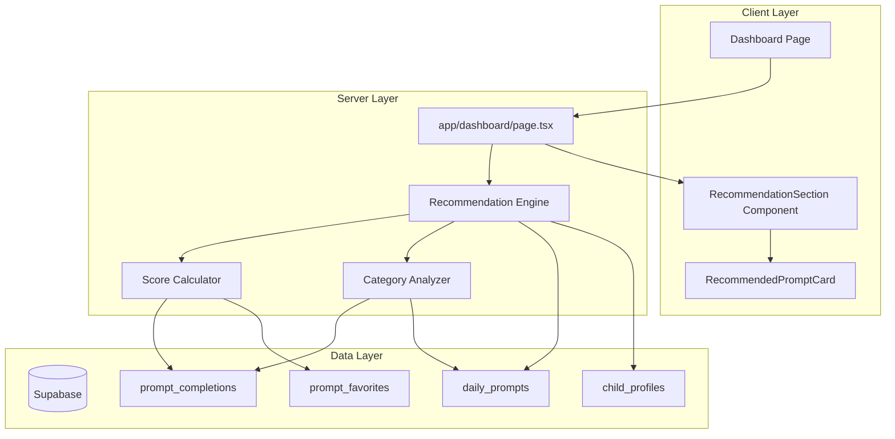
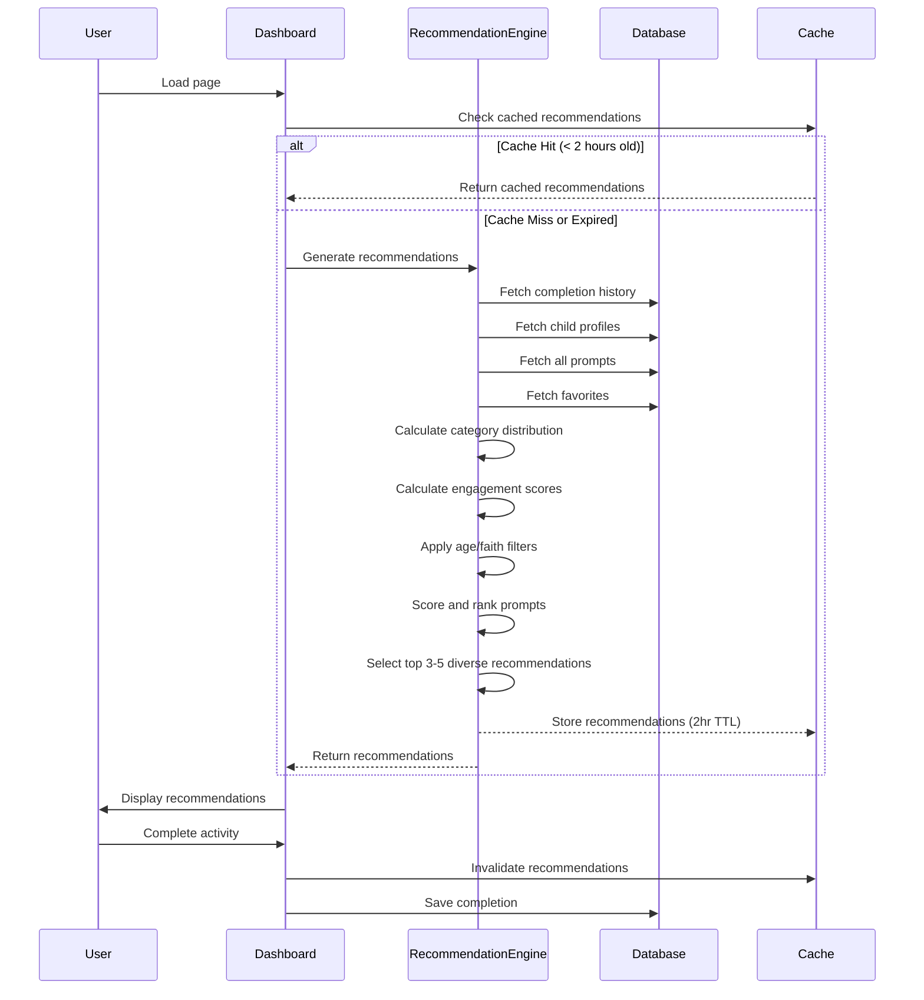

# Smart Prompt Recommendations - Design Document

## Overview

The Smart Recommendations system provides personalized prompt suggestions for each child using a rule-based scoring algorithm that balances category diversity, engagement signals, and age appropriateness. The system leverages existing completion history, child profiles, and favorites data to generate 3-5 tailored recommendations per child, displayed prominently on the dashboard.

**Architecture Philosophy**: Start with a performant rule-based system using existing data, with infrastructure designed to evolve toward ML-based recommendations in the future.

**Key Design Decisions**:
- **Server-side rendering** for recommendations (SEO-friendly, fast initial load)
- **2-hour caching** with smart invalidation on new completions
- **Rule-based scoring** (70% category balance + 20% engagement + 10% filters)
- **Graceful degradation** if recommendation engine fails
- **No new tables** for MVP - use existing schema with optimized queries

## Architecture

### System Components



### Recommendation Flow



## Components and Interfaces

### 1. Recommendation Engine (Server-Side)

**File**: `lib/recommendations/engine.ts`

```typescript
interface RecommendationRequest {
  userId: string
  childId: string
  faithMode: boolean
  limit?: number // Default: 5
}

interface ScoredPrompt {
  prompt: Prompt
  score: number
  reasons: RecommendationReason[]
}

interface RecommendationReason {
  type: 'category_balance' | 'engagement' | 'challenge_match' | 'interest_match' | 'popular'
  message: string // "Great for creative expression - you haven't tried this in 2 weeks"
  weight: number // How much this contributed to final score
}

interface RecommendationResult {
  childId: string
  recommendations: ScoredPrompt[]
  metadata: {
    totalCompletions: number
    categoryDistribution: Record<string, number>
    timestamp: string
    cacheKey: string
  }
}

// Main entry point
export async function generateRecommendations(
  request: RecommendationRequest,
  supabase: SupabaseClient
): Promise<RecommendationResult>

// Core scoring functions
async function calculateCategoryBalanceScore(
  prompt: Prompt,
  completionHistory: Completion[],
  childId: string
): Promise<{ score: number; reason?: RecommendationReason }>

async function calculateEngagementScore(
  prompt: Prompt,
  completionHistory: Completion[],
  favorites: Favorite[]
): Promise<{ score: number; reason?: RecommendationReason }>

function applyAgeFilter(
  prompt: Prompt,
  childAge: number
): boolean

function applyRecencyFilter(
  prompt: Prompt,
  completionHistory: Completion[],
  daysSinceCompletion: number = 14
): boolean
```

### 2. Category Analyzer (Server-Side)

**File**: `lib/recommendations/category-analyzer.ts`

```typescript
interface CategoryStats {
  category: string
  count: number
  percentage: number
  lastCompleted: Date | null
  avgDuration: number | null
  hasReflectionNotes: boolean
}

interface CategoryDistribution {
  stats: CategoryStats[]
  totalCompletions: number
  underrepresented: string[] // < 10% of completions
  overrepresented: string[] // > 30% of completions
  neglected: string[] // Not completed in 14+ days
}

export async function analyzeCategoryDistribution(
  childId: string,
  completionHistory: Completion[]
): Promise<CategoryDistribution>

export function getBalanceBoost(
  category: string,
  distribution: CategoryDistribution
): number // Returns 0.5 to 1.5 multiplier
```

### 3. Score Calculator (Server-Side)

**File**: `lib/recommendations/score-calculator.ts`

```typescript
interface ScoreWeights {
  categoryBalance: number // Default: 0.70
  engagement: number // Default: 0.20
  filters: number // Default: 0.10
}

interface ScoreComponents {
  categoryScore: number
  engagementScore: number
  filterScore: number
  totalScore: number
  reasons: RecommendationReason[]
}

export async function calculatePromptScore(
  prompt: Prompt,
  child: Child,
  completionHistory: Completion[],
  favorites: Favorite[],
  categoryDistribution: CategoryDistribution,
  weights: ScoreWeights = defaultWeights
): Promise<ScoreComponents>

// Engagement sub-scores
function calculateDurationEngagement(
  prompt: Prompt,
  completionHistory: Completion[]
): number // 1.5x if avg duration > estimated

function calculateReflectionEngagement(
  prompt: Prompt,
  completionHistory: Completion[]
): number // 1.5x if has reflection notes

function calculateFavoriteEngagement(
  prompt: Prompt,
  favorites: Favorite[]
): number // 2.0x if favorited
```

### 4. RecommendationSection Component (Client)

**File**: `components/RecommendationSection.tsx`

```typescript
interface RecommendationSectionProps {
  child: Child
  recommendations: ScoredPrompt[]
  onStartActivity: (promptId: string, childId: string) => void
  onDismiss?: (promptId: string) => void
}

export default function RecommendationSection({
  child,
  recommendations,
  onStartActivity,
  onDismiss
}: RecommendationSectionProps): JSX.Element

// Features:
// - Displays child name "Recommended for [Emma]"
// - Grid of 3-5 recommendation cards
// - Animated slide-in on mount
// - Skeleton loading state
// - Empty state if no recommendations
```

### 5. RecommendedPromptCard Component (Client)

**File**: `components/RecommendedPromptCard.tsx`

```typescript
interface RecommendedPromptCardProps {
  prompt: Prompt
  score: number
  reasons: RecommendationReason[]
  childId: string
  onStartActivity: (promptId: string, childId: string) => void
  onDismiss?: (promptId: string) => void
}

export default function RecommendedPromptCard({
  prompt,
  score,
  reasons,
  childId,
  onStartActivity,
  onDismiss
}: RecommendedPromptCardProps): JSX.Element

// Features:
// - Displays prompt title, description, category badge
// - "✨ Personalized" badge
// - Tooltip showing recommendation reasons
// - Estimated time display
// - "Start Activity" button (pre-fills child)
// - "Not Now" dismiss button (optional)
// - Glassmorphism card design matching brand
```

## Data Models

### Extended Types (TypeScript)

```typescript
// Extends existing Prompt type
interface Prompt {
  id: string
  title: string
  description: string
  activity: string
  category: string
  age_categories: string[]
  tags: string[]
  estimated_minutes: number
  created_at: string
}

// Extends existing Completion type
interface Completion {
  id: string
  user_id: string
  prompt_id: string
  child_id: string | null
  completed_at: string
  completion_date: string
  reflection_note: string | null
  duration_seconds: number | null
  created_at: string

  // Joined data for analysis
  prompt?: Prompt
}

// Extends existing Child type
interface Child {
  id: string
  user_id: string
  name: string
  birth_date: string
  age: number // Calculated
  interests: string[]
  personality_traits: string[]
  current_challenges: string[]
  created_at: string
}

// Extends existing Favorite type
interface Favorite {
  id: string
  user_id: string
  prompt_id: string
  created_at: string
}
```

### Database Indexes (New)

```sql
-- Optimize category analysis queries
CREATE INDEX IF NOT EXISTS idx_completions_child_category
ON prompt_completions(child_id, completion_date DESC);

-- Optimize prompt filtering by tags
CREATE INDEX IF NOT EXISTS idx_prompts_tags_gin
ON daily_prompts USING GIN(tags);

-- Optimize engagement queries
CREATE INDEX IF NOT EXISTS idx_completions_duration_notes
ON prompt_completions(child_id, duration_seconds, reflection_note)
WHERE duration_seconds IS NOT NULL OR reflection_note IS NOT NULL;
```

### Cache Schema

**Implementation**: Next.js `unstable_cache` with Redis-like behavior

```typescript
// Cache key format
const cacheKey = `recommendations:${userId}:${childId}:${faithMode}:v1`

// Cache entry structure
interface CachedRecommendation {
  result: RecommendationResult
  generatedAt: string
  expiresAt: string
  version: string // Algorithm version for invalidation
}

// Cache TTL: 2 hours
const CACHE_TTL = 2 * 60 * 60 // 7200 seconds

// Invalidation triggers:
// 1. User completes any activity (invalidate all their cache)
// 2. Child profile updated (invalidate that child's cache)
// 3. Faith mode toggled (invalidate all user cache)
// 4. Manual "refresh recommendations" button
```

## Algorithm Details

### Scoring Formula

```typescript
totalScore = (
  categoryBalanceScore * 0.70 +
  engagementScore * 0.20 +
  filterScore * 0.10
) * recencyMultiplier * diversityMultiplier

// Components:

// 1. Category Balance Score (0-100)
categoryBalanceScore = baseScore * balanceBoost
// balanceBoost: 1.5x if underrepresented, 0.7x if overrepresented, 1.0x neutral

// 2. Engagement Score (0-100)
engagementScore = (
  durationEngagement * 0.4 +
  reflectionEngagement * 0.4 +
  favoriteEngagement * 0.2
)
// durationEngagement: 100 if avg duration > estimate, 50 neutral, 25 if below
// reflectionEngagement: 100 if has notes, 50 neutral
// favoriteEngagement: 100 if favorited, 50 neutral

// 3. Filter Score (0-100)
filterScore = (
  ageMatchScore * 0.5 +
  challengeMatchScore * 0.3 +
  interestMatchScore * 0.2
)
// ageMatchScore: 100 if age matches, 0 if not
// challengeMatchScore: 100 if tags match child challenges, 50 neutral
// interestMatchScore: 100 if tags match child interests, 50 neutral

// 4. Recency Multiplier (0.5-1.0)
recencyMultiplier = max(0.5, 1.0 - (daysSinceCompletion / 30))
// Reduces score if completed recently

// 5. Diversity Multiplier (0.8-1.0)
diversityMultiplier = 1.0 - (sameTagCountInRecommendations * 0.1)
// Prevents too many similar prompts in same batch
```

### Recommendation Selection Algorithm

```typescript
// Step 1: Filter eligible prompts
eligiblePrompts = allPrompts.filter(prompt =>
  applyAgeFilter(prompt, child.age) &&
  applyRecencyFilter(prompt, completionHistory, 14) &&
  applyFaithModeFilter(prompt, faithMode)
)

// Step 2: Score all eligible prompts
scoredPrompts = await Promise.all(
  eligiblePrompts.map(prompt => calculatePromptScore(prompt, ...))
)

// Step 3: Sort by score (descending)
scoredPrompts.sort((a, b) => b.score - a.score)

// Step 4: Select top N with diversity guarantee
recommendations = []
usedCategories = new Set<string>()
usedTags = new Set<string>()

for (const scored of scoredPrompts) {
  if (recommendations.length >= limit) break

  // Ensure category diversity (max 2 from same category)
  const categoryCount = recommendations.filter(
    r => r.prompt.category === scored.prompt.category
  ).length

  if (categoryCount >= 2) continue

  // Ensure tag diversity (max 2 with same primary tag)
  const primaryTag = scored.prompt.tags[0]
  const tagCount = recommendations.filter(
    r => r.prompt.tags[0] === primaryTag
  ).length

  if (tagCount >= 2) continue

  recommendations.push(scored)
  usedCategories.add(scored.prompt.category)
  usedTags.add(primaryTag)
}

// Step 5: Fallback if < 3 recommendations
if (recommendations.length < 3) {
  // Add top-scored age-appropriate prompts regardless of diversity
  const fallbacks = scoredPrompts
    .filter(s => !recommendations.includes(s))
    .slice(0, 3 - recommendations.length)

  recommendations.push(...fallbacks)
}

return recommendations
```

### Special Cases

#### New User (< 3 completions)

```typescript
if (totalCompletions < 3) {
  // Show diverse starter prompts
  return getStarterRecommendations(child.age, faithMode, child.challenges)

  // Algorithm:
  // 1. Pick one from each major category (connection, learning, behavior)
  // 2. Match to child's current_challenges if specified
  // 3. Prefer 5-minute activities for easy first win
  // 4. Include one "quick win" activity with high success rate
}
```

#### All Prompts Completed Recently (< 14 days)

```typescript
if (eligiblePrompts.length === 0) {
  // Show "Greatest Hits" - favorites and high-engagement prompts
  return getGreatestHitsRecommendations(
    completionHistory,
    favorites,
    child.age
  )

  // Algorithm:
  // 1. Prioritize favorited prompts
  // 2. Prompts with longest duration (high engagement)
  // 3. Prompts with reflection notes
  // 4. Show message: "You're doing amazing! Here are some favorites to revisit"
}
```

#### Single Category Domination (> 50% completions)

```typescript
const dominantCategory = categoryDistribution.stats[0]
if (dominantCategory.percentage > 0.5) {
  // Force diversity
  recommendations = recommendations.filter(
    r => r.prompt.category !== dominantCategory.category
  ).slice(0, limit)

  // Add explainer: "Let's try something new! These activities explore different areas"
}
```

## Error Handling

### Recommendation Engine Failures

```typescript
try {
  const recommendations = await generateRecommendations(request, supabase)
  return recommendations
} catch (error) {
  console.error('Recommendation engine failed:', error)

  // Graceful fallback: age-appropriate prompts
  const fallbackPrompts = await supabase
    .from('daily_prompts')
    .select('*')
    .contains('age_categories', [getAgeCategory(child.age)])
    .order('created_at', { ascending: false })
    .limit(5)

  return {
    childId: request.childId,
    recommendations: fallbackPrompts.map(p => ({
      prompt: p,
      score: 50, // Neutral score
      reasons: [{
        type: 'popular',
        message: 'Age-appropriate activity',
        weight: 1.0
      }]
    })),
    metadata: {
      totalCompletions: 0,
      categoryDistribution: {},
      timestamp: new Date().toISOString(),
      cacheKey: ''
    }
  }
}
```

### Database Query Timeouts

```typescript
// Set timeout for recommendation queries
const RECOMMENDATION_TIMEOUT = 500 // ms

const timeoutPromise = new Promise((_, reject) =>
  setTimeout(() => reject(new Error('Recommendation timeout')), RECOMMENDATION_TIMEOUT)
)

const recommendationPromise = generateRecommendations(request, supabase)

try {
  const result = await Promise.race([recommendationPromise, timeoutPromise])
  return result
} catch (error) {
  // Return cached stale data or fallback
  return getCachedOrFallback(request)
}
```

### Empty Recommendation Results

```typescript
if (recommendations.length === 0) {
  // Should never happen due to fallbacks, but handle gracefully
  return (
    <EmptyState
      icon="✨"
      title="No recommendations right now"
      description="Browse our full library of activities below"
      variant="compact"
    />
  )
}
```

## Testing Strategy

### Unit Tests

**File**: `lib/recommendations/__tests__/engine.test.ts`

```typescript
describe('Recommendation Engine', () => {
  describe('calculateCategoryBalanceScore', () => {
    it('boosts underrepresented categories by 50%', async () => {
      const prompt = { category: 'creative_expression', ... }
      const history = [/* 10 completions, 0 creative */]

      const { score, reason } = await calculateCategoryBalanceScore(
        prompt,
        history,
        'child-id'
      )

      expect(score).toBeGreaterThan(50)
      expect(reason.type).toBe('category_balance')
    })

    it('reduces overrepresented categories by 30%', async () => {
      const prompt = { category: 'connection', ... }
      const history = [/* 10 completions, 8 connection */]

      const { score } = await calculateCategoryBalanceScore(
        prompt,
        history,
        'child-id'
      )

      expect(score).toBeLessThan(50)
    })
  })

  describe('calculateEngagementScore', () => {
    it('boosts prompts with long durations', async () => {
      const prompt = { id: 'prompt-1', estimated_minutes: 5 }
      const history = [{
        prompt_id: 'prompt-1',
        duration_seconds: 600 // 10 minutes (2x estimate)
      }]

      const { score } = await calculateEngagementScore(prompt, history, [])
      expect(score).toBeGreaterThan(70)
    })

    it('boosts prompts with reflection notes', async () => {
      const history = [{
        prompt_id: 'prompt-1',
        reflection_note: 'Amazing bonding time!'
      }]

      const { score } = await calculateEngagementScore(prompt, history, [])
      expect(score).toBeGreaterThan(70)
    })
  })

  describe('generateRecommendations', () => {
    it('returns 5 recommendations for new users', async () => {
      const request = {
        userId: 'user-1',
        childId: 'child-1',
        faithMode: false
      }

      const result = await generateRecommendations(request, supabase)
      expect(result.recommendations).toHaveLength(5)
    })

    it('ensures category diversity in recommendations', async () => {
      const result = await generateRecommendations(request, supabase)
      const categories = result.recommendations.map(r => r.prompt.category)
      const uniqueCategories = new Set(categories)

      expect(uniqueCategories.size).toBeGreaterThanOrEqual(3)
    })

    it('respects faith mode filter', async () => {
      const request = { ...baseRequest, faithMode: true }
      const result = await generateRecommendations(request, supabase)

      result.recommendations.forEach(r => {
        expect(r.prompt.tags).toContain('faith-based')
      })
    })
  })
})
```

### Integration Tests

**File**: `app/dashboard/__tests__/recommendations.test.tsx`

```typescript
describe('Dashboard Recommendations', () => {
  it('displays recommendations for each child', async () => {
    const { findByText } = render(<DashboardPage />)

    await findByText(/Recommended for Emma/i)
    await findByText(/Recommended for Noah/i)
  })

  it('shows loading skeleton while fetching', () => {
    const { container } = render(<RecommendationSection loading={true} />)
    expect(container.querySelector('.skeleton')).toBeInTheDocument()
  })

  it('invalidates cache after completion', async () => {
    const { getByText } = render(<DashboardPage />)

    // Complete activity
    fireEvent.click(getByText('Start Activity'))
    await completeActivity()

    // Verify new recommendations fetched
    await waitFor(() => {
      expect(mockGenerateRecommendations).toHaveBeenCalledTimes(2)
    })
  })
})
```

### Performance Tests

```typescript
describe('Recommendation Performance', () => {
  it('completes within 500ms for 100 prompts', async () => {
    const start = Date.now()
    await generateRecommendations(request, supabase)
    const duration = Date.now() - start

    expect(duration).toBeLessThan(500)
  })

  it('handles 1000 completion history items efficiently', async () => {
    const largeHistory = generateMockCompletions(1000)
    const start = Date.now()

    await generateRecommendations({ ...request, history: largeHistory }, supabase)

    const duration = Date.now() - start
    expect(duration).toBeLessThan(1000)
  })
})
```

### Manual Testing Checklist

- [ ] New user sees diverse starter recommendations
- [ ] Recommendations update after completing activity
- [ ] Category balance improves over time (visual verification)
- [ ] Faith mode toggle shows different recommendations
- [ ] Child age change triggers new recommendations
- [ ] Tooltip shows helpful explanation of "why recommended"
- [ ] "Start Activity" pre-fills correct child
- [ ] Recommendations look good on mobile (responsive)
- [ ] Skeleton loading shows during slow network
- [ ] Fallback prompts show if engine fails
- [ ] Cache invalidation works (complete activity, see new recs)
- [ ] Multiple children show separate recommendation sections

## Performance Optimization

### Query Optimization

```typescript
// BAD: N+1 query problem
for (const child of children) {
  const history = await supabase
    .from('prompt_completions')
    .select('*')
    .eq('child_id', child.id)
}

// GOOD: Single query with filtering
const allCompletions = await supabase
  .from('prompt_completions')
  .select('*, daily_prompts(*)')
  .in('child_id', children.map(c => c.id))

// Group by child in application layer
const completionsByChild = groupBy(allCompletions, 'child_id')
```

### Caching Strategy

```typescript
import { unstable_cache } from 'next/cache'

// Cache recommendations with smart invalidation
export const getCachedRecommendations = unstable_cache(
  async (userId: string, childId: string, faithMode: boolean) => {
    return generateRecommendations({ userId, childId, faithMode }, supabase)
  },
  ['recommendations'],
  {
    revalidate: 7200, // 2 hours
    tags: [`recommendations:${userId}:${childId}`]
  }
)

// Invalidate on completion
import { revalidateTag } from 'next/cache'

async function handleCompletion(userId: string, childId: string) {
  await saveCompletion(...)
  revalidateTag(`recommendations:${userId}:${childId}`)
}
```

### Database Indexes

```sql
-- Create optimized indexes for recommendation queries
-- (See "Database Indexes" section in Data Models)

-- Monitor query performance
CREATE EXTENSION IF NOT EXISTS pg_stat_statements;

-- Identify slow queries
SELECT query, mean_exec_time, calls
FROM pg_stat_statements
WHERE query LIKE '%prompt_completions%'
ORDER BY mean_exec_time DESC
LIMIT 10;
```

## Migration Path

### Phase 1: MVP (Current Sprint)
- ✅ Implement rule-based scoring algorithm
- ✅ Server-side recommendation generation
- ✅ Dashboard integration with RecommendationSection
- ✅ Basic caching (2 hours)
- ✅ Performance optimization (indexes)

### Phase 2: Enhanced Intelligence (Post-Demo)
- ⏭️ Track recommendation impressions/clicks
- ⏭️ A/B test different scoring weights
- ⏭️ Add user feedback ("Helpful?" thumbs up/down)
- ⏭️ Implement collaborative filtering (similar users)
- ⏭️ Time-of-day patterns (morning vs evening activities)

### Phase 3: Machine Learning (Future)
- ⏭️ Train ML model on engagement data
- ⏭️ Predict completion probability per prompt
- ⏭️ Natural language processing on reflection notes
- ⏭️ Image recognition for activity photo uploads
- ⏭️ Real-time personalization with edge compute

## Security Considerations

### Row-Level Security (RLS)

```sql
-- Ensure users can only get recommendations for their own children
CREATE POLICY "Users can only access their own recommendations"
ON prompt_completions
FOR SELECT
USING (auth.uid() = user_id);

CREATE POLICY "Users can only access their own children"
ON child_profiles
FOR SELECT
USING (auth.uid() = user_id);
```

### Input Validation

```typescript
// Validate recommendation request
function validateRecommendationRequest(
  request: RecommendationRequest
): boolean {
  if (!request.userId || !isValidUUID(request.userId)) {
    throw new Error('Invalid user ID')
  }

  if (!request.childId || !isValidUUID(request.childId)) {
    throw new Error('Invalid child ID')
  }

  if (request.limit && (request.limit < 1 || request.limit > 20)) {
    throw new Error('Limit must be between 1 and 20')
  }

  return true
}
```

### Rate Limiting

```typescript
// Prevent abuse of recommendation endpoint
import { Ratelimit } from '@upstash/ratelimit'

const ratelimit = new Ratelimit({
  redis: redis,
  limiter: Ratelimit.slidingWindow(10, '1 m'), // 10 requests per minute
})

export async function generateRecommendationsWithRateLimit(
  request: RecommendationRequest,
  userId: string
) {
  const { success } = await ratelimit.limit(`recommendations:${userId}`)

  if (!success) {
    throw new Error('Rate limit exceeded')
  }

  return generateRecommendations(request, supabase)
}
```

## Accessibility

### Screen Reader Support

```tsx
<section aria-labelledby="recommendations-heading">
  <h2 id="recommendations-heading" className="sr-only">
    Recommended activities for {child.name}
  </h2>

  <div role="list" aria-label="Recommended prompts">
    {recommendations.map(rec => (
      <article
        key={rec.prompt.id}
        role="listitem"
        aria-label={`${rec.prompt.title}. ${rec.reasons[0].message}`}
      >
        {/* Card content */}
      </article>
    ))}
  </div>
</section>
```

### Keyboard Navigation

```tsx
<button
  onClick={() => onStartActivity(prompt.id, childId)}
  onKeyDown={(e) => {
    if (e.key === 'Enter' || e.key === ' ') {
      e.preventDefault()
      onStartActivity(prompt.id, childId)
    }
  }}
  aria-label={`Start activity: ${prompt.title}`}
>
  Start Activity
</button>
```

### Focus Management

```tsx
// After completing activity, return focus to recommendation card
const cardRef = useRef<HTMLDivElement>(null)

useEffect(() => {
  if (activityCompleted) {
    cardRef.current?.focus()
  }
}, [activityCompleted])
```

## Monitoring and Observability

### Metrics to Track

```typescript
// Track recommendation performance
interface RecommendationMetrics {
  generationTime: number // ms
  cacheHitRate: number // %
  avgRecommendationsPerUser: number
  clickThroughRate: number // % of recommendations clicked
  completionRate: number // % of clicked recommendations completed
  categoryDiversityScore: number // Shannon entropy
}

// Log metrics to analytics
function logRecommendationMetrics(metrics: RecommendationMetrics) {
  analytics.track('recommendations_generated', {
    ...metrics,
    timestamp: new Date().toISOString()
  })
}
```

### Error Tracking

```typescript
import * as Sentry from '@sentry/nextjs'

try {
  const recommendations = await generateRecommendations(request, supabase)
} catch (error) {
  Sentry.captureException(error, {
    tags: {
      component: 'recommendation_engine',
      userId: request.userId,
      childId: request.childId
    },
    extra: {
      request,
      completionCount: completionHistory.length
    }
  })

  // Return fallback
  return getFallbackRecommendations(request)
}
```

## Summary

The Smart Recommendations system provides personalized, context-aware prompt suggestions using a rule-based scoring algorithm that balances category diversity, engagement signals, and child-specific attributes. The system is designed for performance (sub-500ms generation, 2-hour caching) and graceful degradation, with a clear migration path toward ML-based recommendations in the future.

**Key Technical Decisions**:
- Server-side rendering for fast initial load
- Rule-based scoring (70-20-10 split) for transparency
- No new database tables for MVP (use existing schema)
- Smart caching with invalidation triggers
- Comprehensive fallback strategies

**User Experience Goals**:
- Reduce time-to-activity-start by 50%
- Increase category diversity in completions by 30%
- Provide clear explanations for "why recommended"
- Zero-friction activity start (pre-filled child selection)

**Next Steps**: Proceed to tasks.md to break down implementation into incremental coding tasks.
