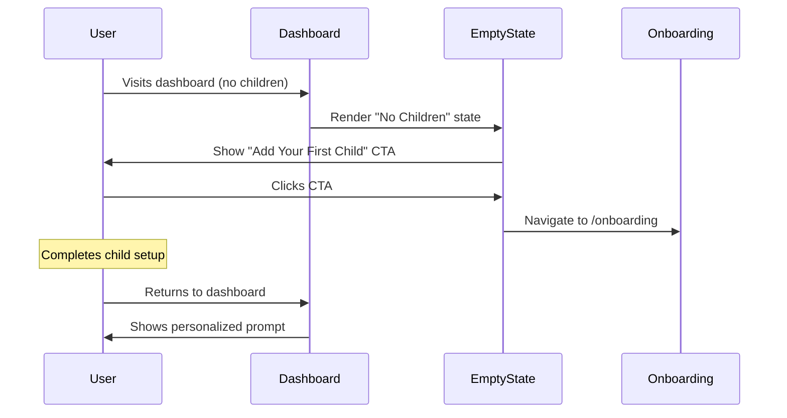
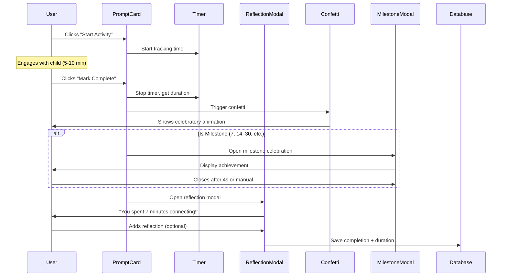
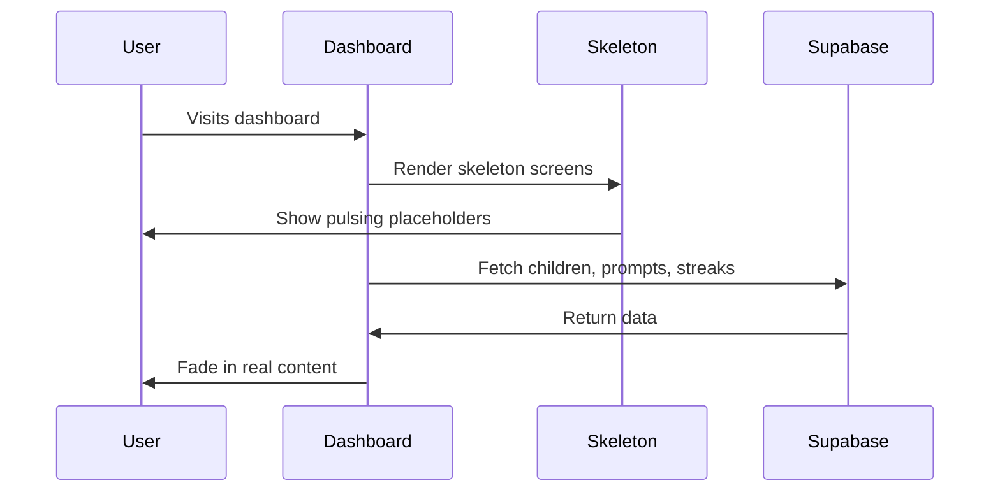

# Design Document: UX Enhancement Features

## Overview
This design implements empty states, completion celebrations, and activity time tracking to create a polished, emotionally engaging experience for parents. The features use React client components, Supabase for data persistence, and CSS animations for smooth, accessible interactions.

## Architecture

### Component Structure
```
components/
├── EmptyState.tsx              # Reusable empty state component
├── ConfettiCelebration.tsx     # Confetti animation wrapper
├── MilestoneCelebration.tsx    # Milestone achievement modal
├── ActivityTimer.tsx           # Timer display and controls
├── SkeletonPromptCard.tsx      # Loading skeleton for prompts
├── SkeletonChildProfile.tsx    # Loading skeleton for child profiles
└── DashboardClient.tsx         # Updated with new features

app/
├── dashboard/page.tsx          # Updated with loading states
├── children/[id]/profile/page.tsx  # Updated with skeletons
└── favorites/page.tsx          # Updated with empty state
```

### Database Schema Updates
```sql
-- Add duration tracking to prompt_completions
ALTER TABLE prompt_completions
  ADD COLUMN IF NOT EXISTS duration_seconds INTEGER,
  ADD COLUMN IF NOT EXISTS started_at TIMESTAMP WITH TIME ZONE;

-- Add estimated duration to daily_prompts
ALTER TABLE daily_prompts
  ADD COLUMN IF NOT EXISTS estimated_minutes INTEGER DEFAULT 5;
```

## Components and Interfaces

### 1. EmptyState Component
**Purpose**: Reusable component for all empty states

```typescript
interface EmptyStateProps {
  icon: string  // Emoji or icon
  title: string
  description: string
  actionLabel?: string
  actionHref?: string
  onAction?: () => void
}
```

**Visual Design**:
- Large emoji/icon (text-6xl)
- Bold title (text-2xl)
- Gray description text
- Gradient CTA button
- Soft background with border

### 2. ConfettiCelebration Component
**Purpose**: Confetti animation using canvas-confetti library

```typescript
interface ConfettiCelebrationProps {
  trigger: boolean  // When true, fires confetti
  onComplete?: () => void
}
```

**Implementation**:
- Uses `canvas-confetti` library (lightweight, 9KB)
- Fires from bottom center, spreads upward
- Colors match brand palette (#6C63FF, #FFC98A, #F9EAE1)
- Duration: 2.5 seconds
- Respects `prefers-reduced-motion`

### 3. MilestoneCelebration Component
**Purpose**: Special modal for streak milestones

```typescript
interface MilestoneCelebrationProps {
  milestone: 7 | 14 | 30 | 60 | 90 | 'first'
  isOpen: boolean
  onClose: () => void
}
```

**Milestone Messages**:
- **First Activity**: "Your First Connection! 🌟 You just started something beautiful"
- **7 Days**: "One Week Strong! 🎉 You're building a habit"
- **14 Days**: "Two Weeks! 💪 You're making this a lifestyle"
- **30 Days**: "One Month! 🎨 You've built something beautiful"
- **60 Days**: "Two Months! 🚀 Your consistency is inspiring"
- **90 Days**: "Three Months! 🌟 You're a connection champion"

**Visual Design**:
- Full-screen overlay with backdrop blur
- Large animated emoji (scale + rotation)
- Gradient background matching milestone
- "Share Achievement" button (future feature)
- Auto-closes after 4 seconds or manual close

### 4. ActivityTimer Component
**Purpose**: Track and display activity duration

```typescript
interface ActivityTimerProps {
  isActive: boolean
  estimatedMinutes: number
  onComplete: (durationSeconds: number) => void
}
```

**State Management**:
```typescript
const [startTime, setStartTime] = useState<number | null>(null)
const [elapsedSeconds, setElapsedSeconds] = useState(0)
const [isRunning, setIsRunning] = useState(false)
```

**Timer Logic**:
- Updates every 10 seconds (battery-friendly)
- Stores start time in localStorage (persist across refreshes)
- Displays as "X min Y sec"
- Shows progress bar relative to estimated time
- Changes color when exceeding estimate (orange, not red - encouraging)

### 5. Skeleton Components
**Purpose**: Loading states that match real component dimensions

**SkeletonPromptCard**:
- Mimics TodaysPromptCard layout
- Pulsing animation (animate-pulse)
- Same rounded corners, padding, shadow

**SkeletonChildProfile**:
- Mimics profile page sections
- Skeleton bars for stats
- Skeleton circles for emoji reactions
- Staggered animation delays for visual interest

## Data Models

### Updated PromptCompletion
```typescript
interface PromptCompletion {
  id: string
  user_id: string
  prompt_id: string
  child_id: string | null
  completed_at: string
  completion_date: string
  reflection_note: string | null
  duration_seconds: number | null  // NEW
  started_at: string | null        // NEW
}
```

### Updated DailyPrompt
```typescript
interface DailyPrompt {
  id: string
  title: string
  description: string
  activity: string
  category: string
  age_categories: string[]
  tags: string[]
  estimated_minutes: number  // NEW
  date: string
  created_at: string
}
```

## User Experience Flows

### Flow 1: First-Time User Journey


### Flow 2: Activity Completion with Celebration


### Flow 3: Loading Experience


## Error Handling

### Timer Errors
- **Browser refresh mid-activity**: Check localStorage for `activity_start_time`, restore if <30 min old
- **Timer runs >1 hour**: Show modal "Were you still connecting? Or should we pause the timer?"
- **Negative duration**: Validate before saving, default to estimated_minutes

### Animation Errors
- **Confetti fails to load**: Gracefully skip animation, log error
- **Reduced motion preference**: Skip all animations, show static success message
- **Modal doesn't close**: Add escape key handler and backdrop click

### Loading Errors
- **Data fetch fails**: Show error state with retry button
- **Timeout (>10 seconds)**: Show "Taking longer than expected" message with retry

## Testing Strategy

### Unit Tests
- EmptyState renders correct props
- Timer calculations are accurate
- Milestone detection logic works for all thresholds
- Skeleton components match real component dimensions

### Integration Tests
- Activity completion flow saves duration correctly
- Confetti triggers on completion
- Milestone modal appears only at correct streaks
- Loading states transition to real content

### Visual Regression Tests
- Screenshot empty states
- Verify skeleton matches real component
- Test animations on different screen sizes

### Accessibility Tests
- All empty state CTAs are keyboard accessible
- Confetti respects `prefers-reduced-motion`
- Milestone modal can be dismissed with Escape key
- Timer displays aria-live updates for screen readers
- Loading states have proper aria-busy attributes

## Performance Considerations

### Animation Performance
- Use CSS transforms (not position changes) for smooth 60fps
- Confetti uses canvas, hardware-accelerated
- Debounce timer updates (10 second intervals)
- Lazy load canvas-confetti library

### Loading Performance
- Skeleton components render instantly (no data fetching)
- Minimize layout shift when real content loads
- Use Suspense boundaries for progressive loading

### Database Performance
- Duration and start_time are optional fields (no migration breaking changes)
- Index on completion_date for fast streak queries
- Batch update queries where possible

## Deployment Plan

1. **Database Migration**: Add duration fields to production
2. **Install Dependencies**: `canvas-confetti` library
3. **Deploy Components**: Empty states first (lowest risk)
4. **Deploy Timer**: Add timer to prompt card
5. **Deploy Celebrations**: Confetti and milestones
6. **Deploy Skeletons**: Replace loading states
7. **Monitor**: Check error rates, user engagement metrics
8. **Iterate**: Gather user feedback, adjust animations

## Future Enhancements
- Social sharing of milestones
- Custom milestone messages based on faith_mode
- Weekly summary emails with total time spent
- Activity duration insights ("You connect most on weekends")
- Gamification: badges, achievements, challenges
