# The Next 5 Minutes - Architecture Diagram

## Overview

This document contains the complete architecture diagram for The Next 5 Minutes parenting app, showing how all components, services, and data flows work together.

## System Architecture Diagram (Mermaid)

```mermaid
graph TB
    subgraph Browser["User's Browser"]
        UI[React UI Components]
        SC[Server Components]
        CC[Client Components]
    end

    subgraph Vercel["Vercel - Next.js Application"]
        Dashboard[Dashboard Page]
        ChildProfile[Child Profile Page]
        CheckoutAPI[Checkout API]
        WebhookAPI[Webhook API]
        RecEngine[Recommendation Engine]
        Insights[Insights Calculator]
    end

    subgraph Supabase["Supabase Database"]
        Auth[Authentication JWT]
        ProfilesDB[profiles table]
        ChildrenDB[child_profiles table]
        PromptsDB[daily_prompts table]
        CompletionsDB[prompt_completions table]
        RLS[Row Level Security]
    end

    subgraph External["External Services"]
        Stripe[Stripe Payments]
        OpenAI[OpenAI API]
        GoogleCal[Google Calendar]
        Sentry[Sentry Monitoring]
    end

    %% Main User Flow
    UI -->|1. Load App| Dashboard
    Dashboard -->|2. Auth Check| Auth
    Auth -->|3. Verify JWT| RLS
    Dashboard -->|4. Fetch Data| ChildrenDB
    Dashboard -->|5. Generate| RecEngine
    RecEngine -->|6. Query History| CompletionsDB
    RecEngine -->|7. Return Top 5| Dashboard
    Dashboard -->|8. Render| UI

    %% Activity Completion Flow
    UI -->|Start Activity| CC
    CC -->|Submit Notes| CompletionsDB
    CompletionsDB -->|Update Streak| Dashboard

    %% Payment Flow
    UI -->|Upgrade| CheckoutAPI
    CheckoutAPI -->|Create Session| Stripe
    Stripe -->|Webhook Event| WebhookAPI
    WebhookAPI -->|Update Status| ProfilesDB

    %% Profile Page Flow
    UI -->|View Profile| ChildProfile
    ChildProfile -->|Get Stats| Insights
    Insights -->|Query Data| CompletionsDB
    ChildProfile -->|Display| UI

    %% Security Layer
    RLS -.->|Enforce| ProfilesDB
    RLS -.->|Enforce| ChildrenDB
    RLS -.->|Enforce| CompletionsDB

    %% External Integrations
    RecEngine -->|AI Tips| OpenAI
    Dashboard -->|Track Errors| Sentry
    Dashboard -->|Sync Events| GoogleCal

    style UI fill:#e1f5ff
    style Dashboard fill:#fff3cd
    style RecEngine fill:#fff3cd
    style Auth fill:#d4edda
    style RLS fill:#d4edda
    style Stripe fill:#f8d7da
    style OpenAI fill:#f8d7da
```



## Key Data Flows

### 1. Initial Page Load
```
User Browser → Vercel Edge → Middleware (auth check) → Dashboard Page (SSR)
  → Supabase Auth (verify JWT)
  → Database Queries (parallel):
    - Get children
    - Get prompts
    - Get completions
    - Get streak
    - Get stats
  → Recommendation Engine (generate top 5 per child)
  → Render HTML → Send to Browser
```

### 2. Start Activity Flow
```
User clicks "Start Activity" on ChildCard
  → Client Component state update
  → Show ReflectionModal
  → User enters notes
  → Submit to Database
  → Insert into prompt_completions table
  → RLS verifies user_id
  → Database function updates streak
  → Page refresh (router.refresh())
  → Re-fetch all data
  → Recommendation engine recalculates
  → New recommendations displayed (excludes completed)
```

### 3. Payment Flow
```
User clicks "Upgrade" → /api/checkout
  → Get/Create Stripe customer
  → Create checkout session
  → Redirect to Stripe
  → User completes payment on Stripe
  → Stripe calls /api/webhook
  → Verify webhook signature
  → Update subscription_status in profiles table
  → User redirected back with success
```

### 4. Authentication Flow
```
User signs up → Supabase Auth
  → Hash password (bcrypt)
  → Store in auth.users
  → Generate JWT token
  → Set httpOnly cookie
  → Database trigger creates profile row
  → Redirect to /onboarding
```

## Technology Stack

### Frontend
- **Framework**: Next.js 16 (App Router)
- **UI Library**: React 19
- **Styling**: Tailwind CSS
- **State**: React hooks (useState, useEffect)

### Backend
- **Runtime**: Node.js (Vercel serverless)
- **API**: Next.js API Routes
- **Auth**: Supabase Auth (JWT)
- **Validation**: Zod schemas

### Database
- **Service**: Supabase (PostgreSQL)
- **Security**: Row Level Security (RLS)
- **Functions**: SQL stored procedures
- **Indexes**: B-tree on user_id, child_id, dates

### External Services
- **Hosting**: Vercel (Edge Network + Serverless)
- **Payments**: Stripe (SaaS billing)
- **AI**: OpenAI GPT-4
- **Calendar**: Google Calendar API
- **Monitoring**: Sentry + Vercel Analytics

## Security Layers

1. **Edge**: Middleware validates sessions via cookies
2. **Application**: Server-side auth checks before data access
3. **Database**: Row Level Security enforces user_id = auth.uid()
4. **API**: Webhook signature verification (Stripe)
5. **Input**: Zod validation on all user inputs

## Performance Optimizations

1. **Parallel Queries**: 5 database queries in Promise.all()
2. **Database Indexes**: Fast lookups on user_id, child_id
3. **Server Components**: Zero JavaScript for static content
4. **Edge Caching**: Static pages cached at CDN
5. **React.memo**: Prevent re-renders of ChildCard

## Scalability Considerations

- **Current**: Handles 100s of concurrent users
- **Bottleneck**: Recommendation engine (350ms avg)
- **Future**: Add Redis caching for recommendations
- **Database**: PostgreSQL can scale to 10,000+ users

## Deployment Architecture

```
GitHub (push) → Vercel (CI/CD) → Build → Deploy to Edge
  ↓
Environment Variables loaded
  ↓
Supabase connection established
  ↓
Stripe webhooks configured
  ↓
Sentry monitoring activated
  ↓
Production live at 5app-*.vercel.app
```

---

## How to Use This Diagram

1. **For Technical Interviews**: Walk through the complete flow from browser to database
2. **For Feature Planning**: Identify which components need changes
3. **For Debugging**: Trace the path of data to find issues
4. **For Onboarding**: Help new team members understand the system

## Rendering the Diagram

### Option 1: Mermaid Live Editor
1. Go to https://mermaid.live/
2. Copy the Mermaid code above
3. Paste into the editor
4. Export as PNG or SVG

### Option 2: VS Code Extension
1. Install "Markdown Preview Mermaid Support"
2. Open this file in VS Code
3. Click "Preview" button
4. Right-click diagram → Save as image

### Option 3: GitHub
1. Push this file to GitHub
2. View in GitHub (automatically renders Mermaid)
3. Take screenshot for presentations
